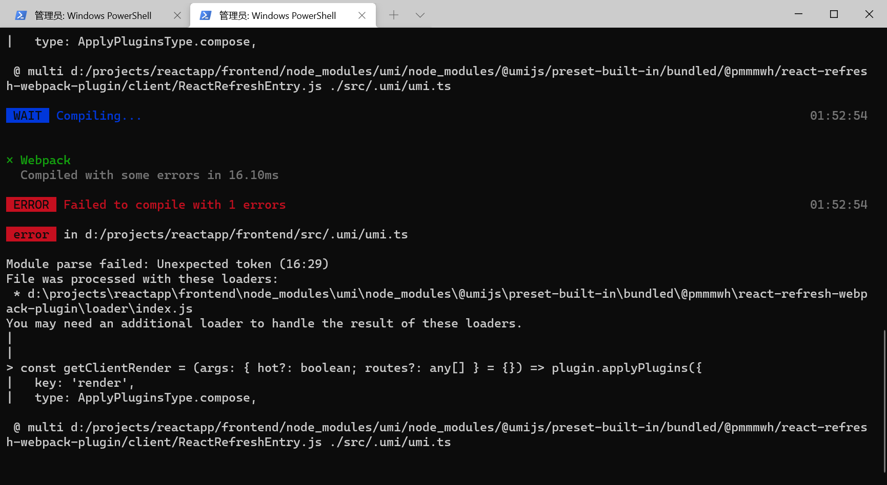
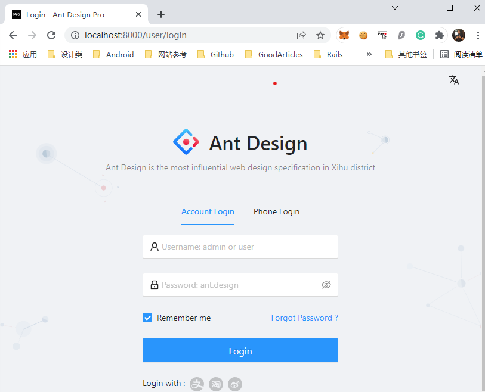

# Getting Started

## Frontend

### 1. Download & Install Node.js

Go to https://nodejs.org/en/ to download 16.14.0.LTS

### 2. Download Git client

https://git-scm.com/downloads 

### 3. Install yarn

```bash
npm install --global yarn
```

 For **User who don't have SYSTEM permission**, please add USER ENV:path on your POWERSHELL

Copy and paste following code to your Powershell

```powershell
[environment]::SetEnvironmentvariable("PATH", "$([environment]::GetEnvironmentvariable("Path", "User"));%USERPROFILE%\AppData\Roaming\npm", "User")
```

Note: 
    if you got an error with "**cannot be loaded because running scripts is disabled on this system**"

```bash
Set-ExecutionPolicy RemoteSigned
```

(run as administrator)

### 4. Install a umi-app

```bash
mkdir umiapp 
cd umiapp
yarn create @umijs/umi-app
yarn

yarn start
```

If you get an error with windows when webpacking: **Module parse failed: Unexpected token (16:29)**
MAKE SURE the file path not on **c**: or not under a **hardlink**.

### 5. Create a frontend react app with Ant design pro

Go to projects folder

```bash
yarn create umi frontend
cd frontend
yarn

yarn start dev

```

Result
