# Foreground App with .Net 6 MVC architecture and Sql Server/Sqlite

## 1. Intro

This doc teaches creating an ASP.NET Core MVC Web App with controllers and views. We will have an app that displays a personal CV.

To see the prototype, please click [Prototype of MyWebSite Project](../Prototypes/MyWebSite/README.md)

**Objectives:**

- Create a web app with Visual Studio 2022
- Create Controller and View layers
- Using a model to work with databases (Sqlite or SqlServer)
- Upload files.

## 2. Prerequisites

- Visual Studio 2022
- Bootstrap
- SQLite Administrator

## 3. Create a new project

- Start Visual Studio and choose **Create a New Project**
- Select **ASP.NET Core Web App (Model-View-Controller)** and **Next**
- Project name: *MyWebSite*（name should be Pascal Case）and **Next**
- Framework: **.NET 6.0 (long-term support)** and check **Enable Docker**
- Create

**NOTE**: Four common naming styles.

```bash
camelCase
PascalCase
snake_case
kebab-case
```

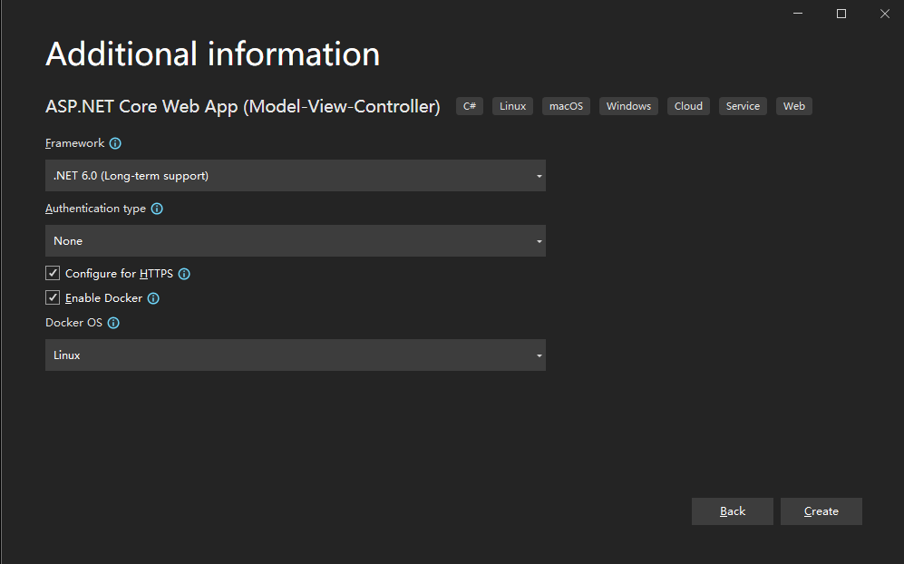

- Click menu **Debug** or **Docker** and choose **MyWebSite Debug Properties**

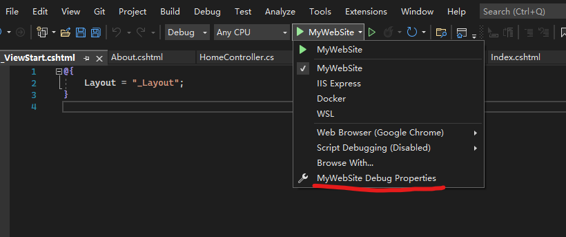

- To specify the port, copy following code to **App URL**

```bash
https://localhost:7177;http://localhost:5177
```

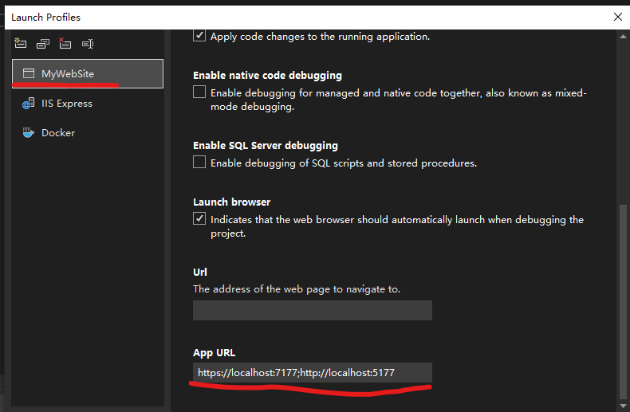

- Change Run Mode from **Docker** to **MyWebSite** and **Run (F5)**

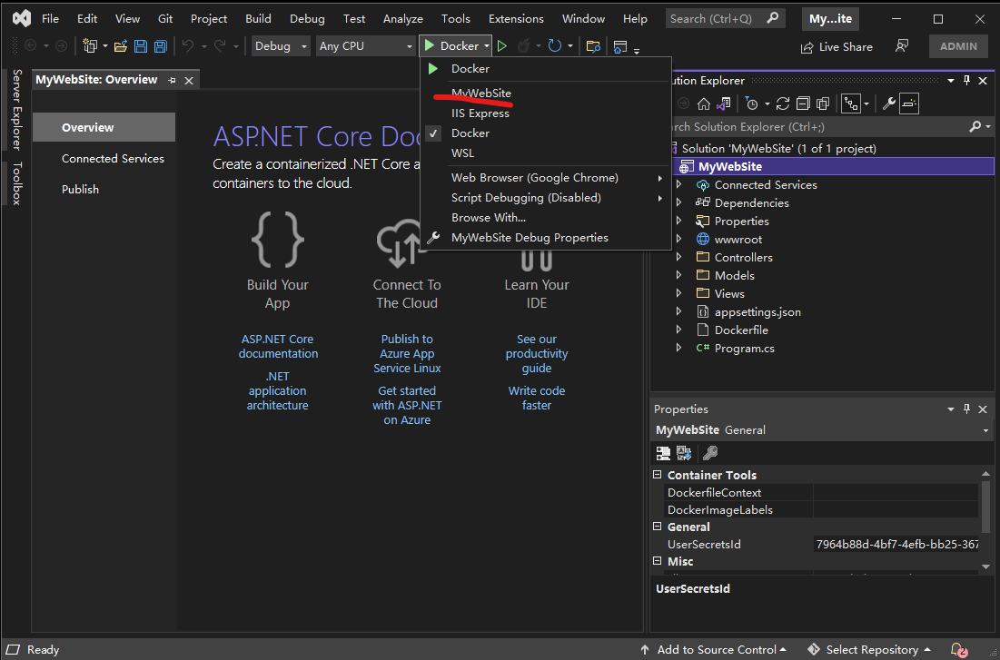

- See the result on the browser
  
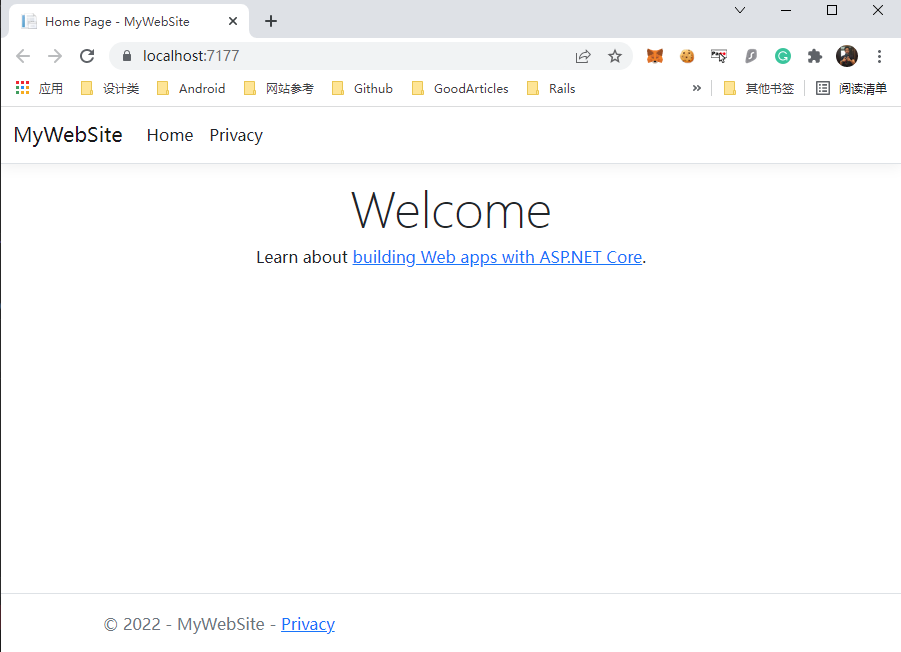

## 4. New Page - add a controller

The Model-View-Controller (MVC) architectural pattern separates an app into three main components: Model, View, and Controller. The MVC pattern helps you create apps that are more testable and easier to update than traditional monolithic apps(Rick Anderson, 2022).

MVC-based apps contain:

- Models: Classes that represent the data of the app. The model classes use validation logic to enforce business rules for that data. Typically, model objects retrieve and store model state in a database. In this article, we will create a Experience model retrieves work history data from a database, provides it to the view or updates it. Updated data is written to a database.
- Views: Views are the components that display the app's user interface (UI). Generally, this UI displays the model data.
- Controllers: Classes that:
  - Handle browser requests.
  - Retrieve model data.
  - Call view templates that return a response.

In an MVC app, the view only displays information. The controller handles and responds to user input and interaction. For example, the controller handles URL segments and query-string values, and passes these values to the model. The model might use these values to query the database. For example:

**https://localhost:7177/Home/Privacy**: specifies the **Home** controller and the **Privacy** action.

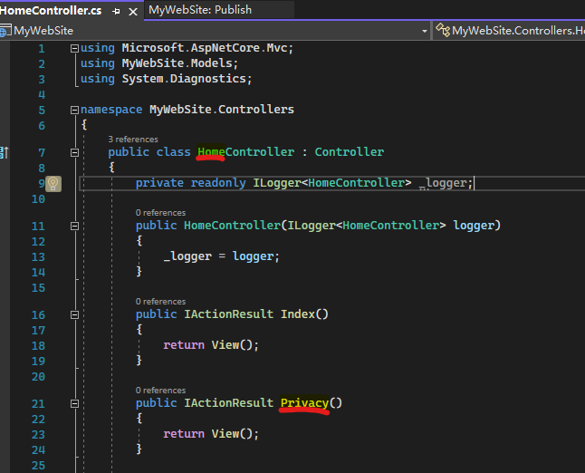

### Add a controller

This section will build the controller for the **Contact** page.

- In Solution Explorer, right-click **Controllers** > **Add** > **Controller**.
  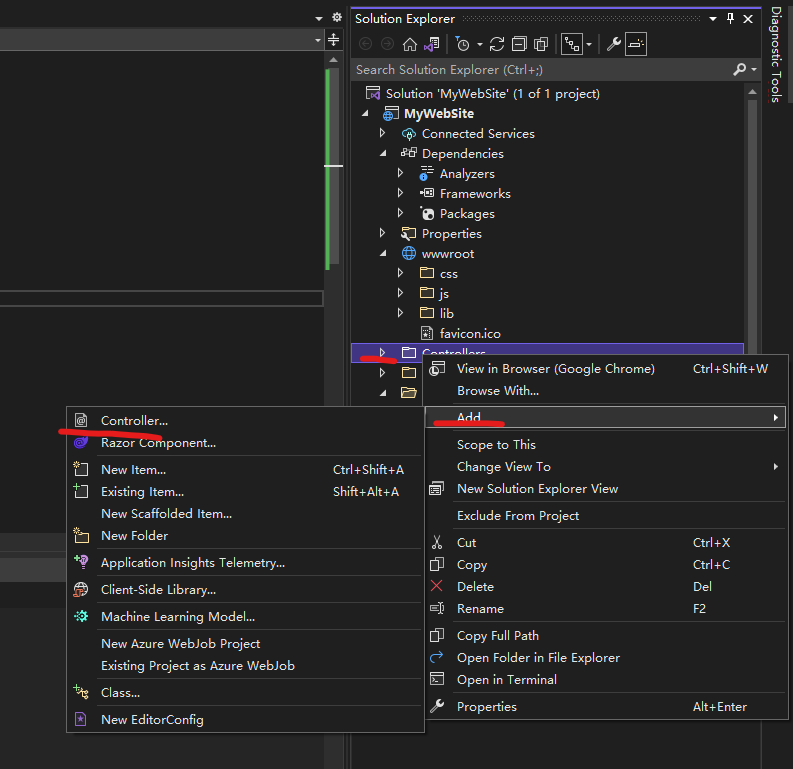
- Choose MVC Controller - Empty > Add.
  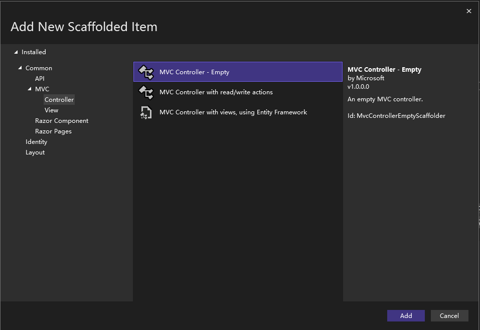
- Name: ContactController.cs
  

- Add following code after *Index()* method

```cs
        public string test()
        {
            return "test";
        }
```

- Run and Go to *https://localhost:7177/contact/test*
  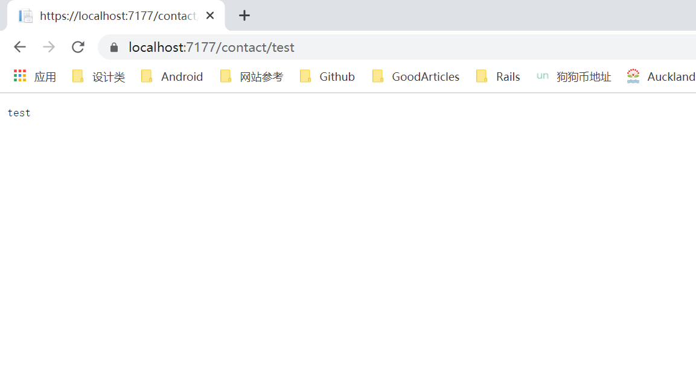

- Customize Path for an action (*Contact/test*)
  
  We want to change *https://localhost:7177/contact/test* to *https://localhost:7177/contact-test*

  Copy following code replace test() method

  ```cs
        [Route("/contact-test")]
        public string test()
        {
            return "test";
        }
  ```

  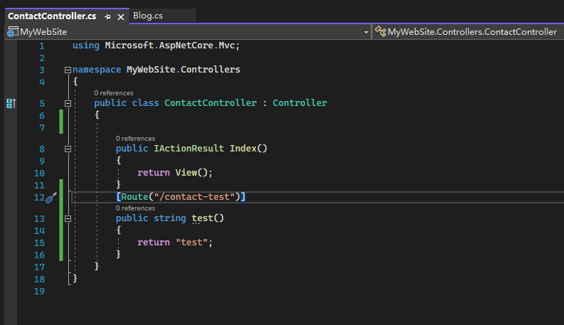

  **Run** and go to *<https://localhost:7177/contact-test>*

  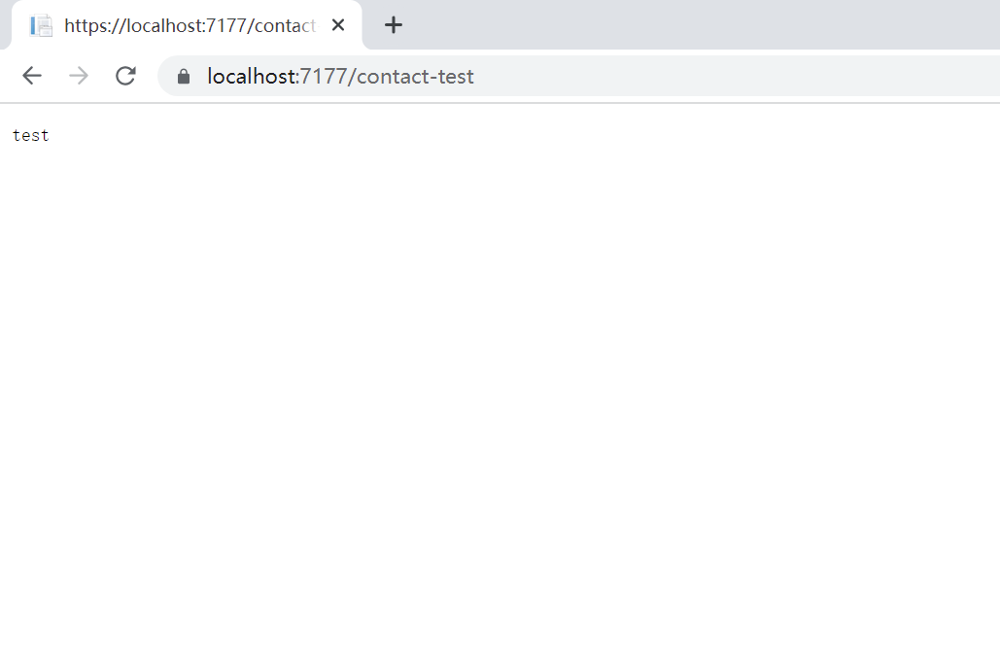

## 5. Add a view

If we now try to access *https://localhost:7177/contact*, we will get an unhandled exception. Because we did not assign a view file(\*\.cshtml) to action *Index()*

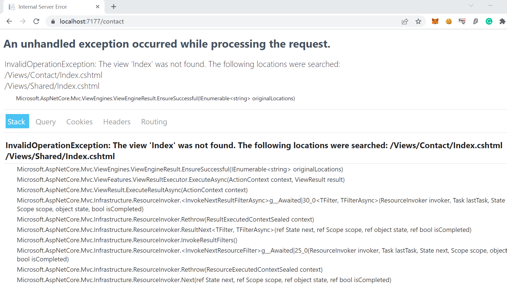

Now, let's start creating the new View file for the controller ContactController.

### Add a view file for action *Index()*

- Right-click **Views** > **Add** > **New Folder**

  Folder name: **Contact**
  
  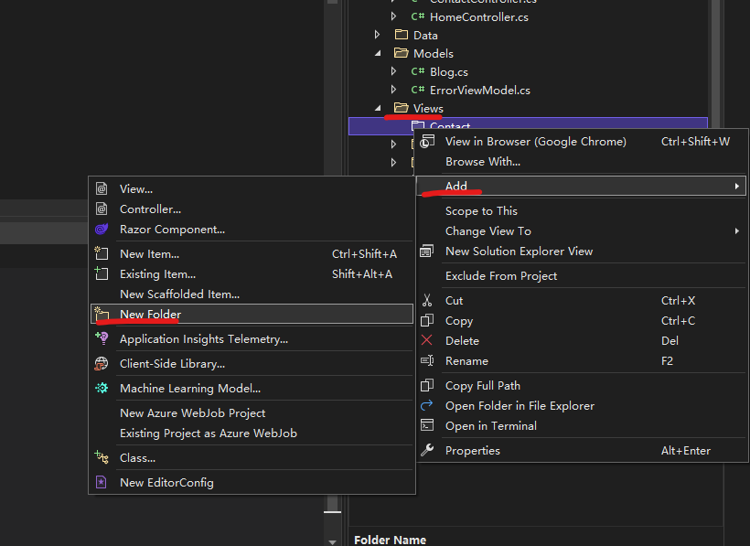

- Right-click **Contact** > **Add** > **View**
  
  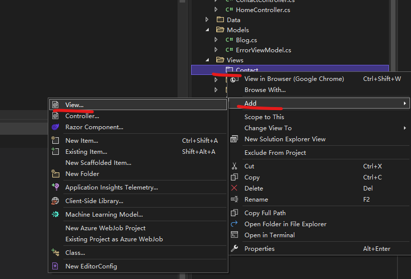

- Replace the contents *index.cshtml* with the following code

  ```cshtml
    @{
        ViewData["Title"] = "Contact Me";
    }

    <div class="text-center">
        <h1 class="display-4">Contact</h1>
        <p>If you have questions, feel free to send an email to me. maxazure@gmail.com</p>
    </div>
  ```

## Change views and layout pages

- Append following html code to the links section after **Home** in Views/Shared/_Layout.cshtml
  
  ```html
  <li class="nav-item">
     <a class="nav-link text-dark" asp-area="" asp-controller="Contact" asp-action="Index">Contact</a>
  </li>
  ```

  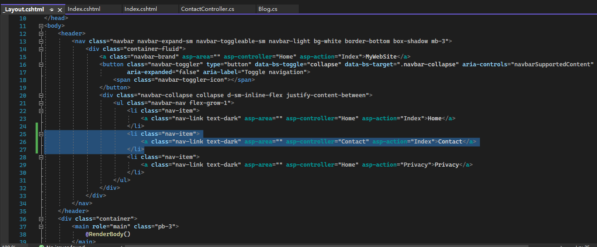

  Layout templates allow:

  - Specifying the HTML container layout of a site in one place.

  - Applying the HTML container layout across multiple pages in the site.

### Examine the Views/_ViewStart.cshtml file

```cshtml
@{
    Layout = "_Layout";
}
```

The *Views/_ViewStart.cshtml* file brings in the *Views/Shared/_Layout.cshtml* file to each view. The *Layout* property can be used to set a different layout view, or set it to *null* so no layout file will be used.

## Try these yourself

Try to modify the **Privacy** page to **About**, and fill in some text as the content.

List of files that need to be modified:

- HomeController.cs
- _Layout.cshtml
- Privacy.cshtml

The result should be similar to the image below:

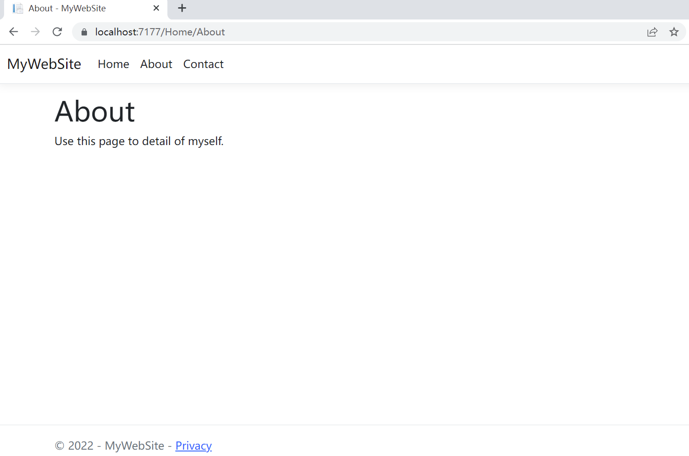

## 6. Add a model

Next, We are going to add classes for page *Experience*. these classes are the **MODEL** part of **M**VC app.

These model classes are used with [Entity Framework Core (EF Core)](https://docs.microsoft.com/en-us/ef/core/) to work with a database. EF Core is an object-relational mapping (ORM) framework that simplifies the data access code that you have to write.

The model classes created are known as **POCO** classes, from **P**lain **O**ld **C**LR **O**bjects. POCO classes don't have any dependency on EF Core. They only define the properties of the data to be stored in the database.

In this section, model classes are created first, and EF Core creates the database.

## Add a data model class

- Right-click the Models folder > **Add** > **Class**. Name the file *Experience.cs*.

- Update the Models/Experience.cs file with the following code:

```cs
using System.ComponentModel.DataAnnotations;

namespace MyWebSite.Models
{
    public class Experience
    {
        public int Id { get; set; }
        public string? Title { get; set; }
        public string? Location { get; set; }
        public string? Duration { get; set; }
        public string? description { get; set; }

        [DataType(DataType.Date)]
        public DateTime CreateAt { get; set; }
    }
}
```

The *Experience* class contains an **Id** field, which is required by the database for the primary key.

The DataType attribute on CreateAt specifies the type of the data (**Date**). With this attribute:

The user isn't required to enter time information in the date field.
Only the date is displayed, not time information.

[DataAnnotations](https://docs.microsoft.com/en-us/dotnet/api/system.componentmodel.dataannotations?view=net-6.0) are covered in a later tutorial.

The question mark after **string** indicates that the property is nullable. For more information, see [Nullable reference types](https://docs.microsoft.com/en-us/dotnet/csharp/nullable-references).

## Add NuGet packages

- From the Tools menu, select NuGet Package Manager > Package Manager Console (PMC).

  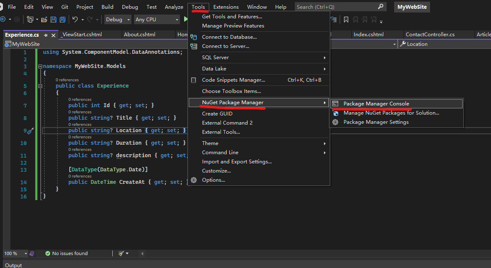

```powershell
Install-Package Microsoft.EntityFrameworkCore.Design
Install-Package Microsoft.EntityFrameworkCore.Sqlite
```

### NOTE: Update EF-tools if your EF-tools is out of date

```powershell
dotnet tool update --global dotnet-ef
```

Build the project as a check for compiler errors.

## Scaffold Experience pages

Use the scaffolding tool to generate Create, Read, Update, and Delete (CRUD) pages for the Experience model.

- In Solution Explorer, right-click the Controllers folder and select **Add** > **New Scaffolded Item**.

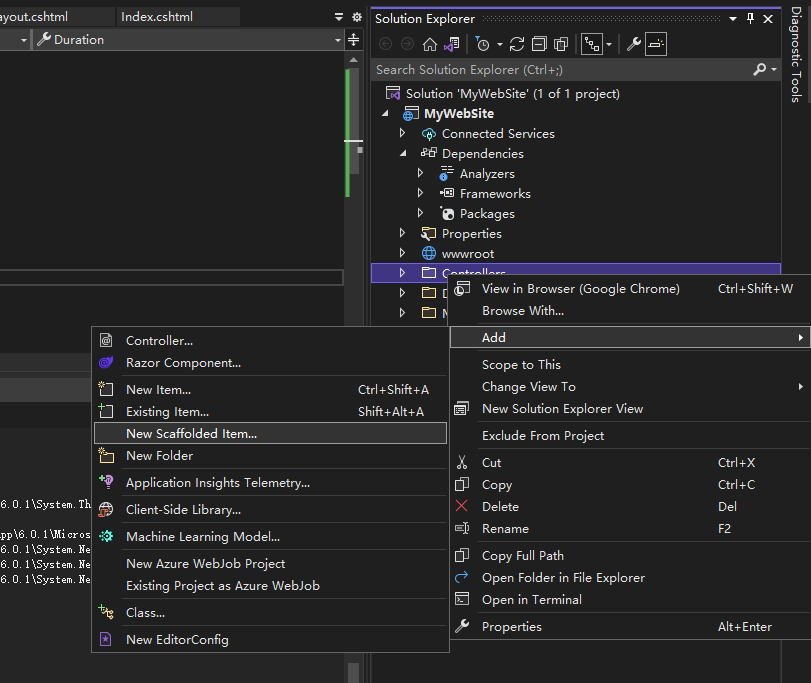
  
- In the Add Scaffold dialog, select MVC Controller with views, using Entity Framework > Add.

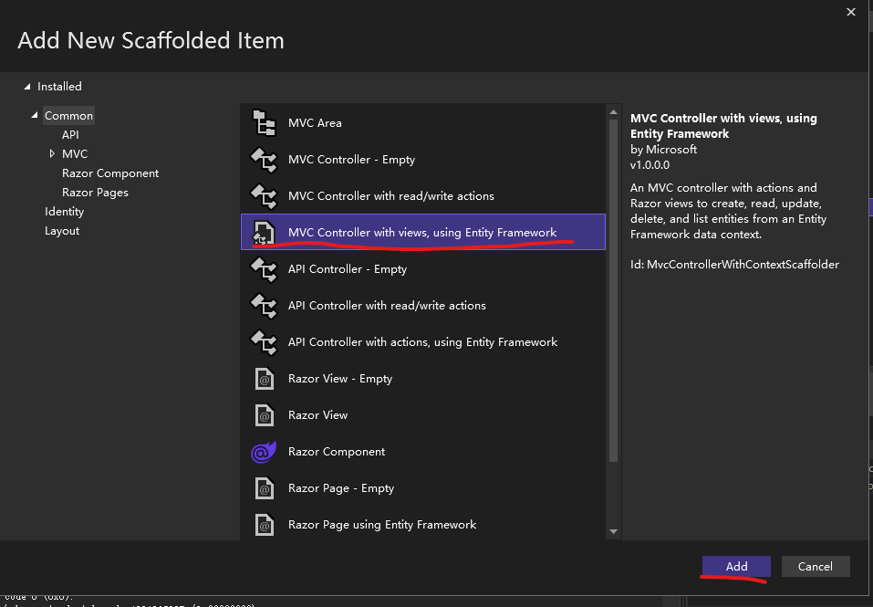

Complete the Add MVC Controller with views, using Entity Framework dialog:

- In the Model class drop down, select **Experience (MyWebSite.Models)**.

- In the Data context class row, select the + (plus) sign.
  - In the Add Data Context dialog, the class name **MyWebSite.Data.MyWebSiteContext** is generated.
  - Select **Add**.
- Views and Controller name: Keep the default.
- Select Add.

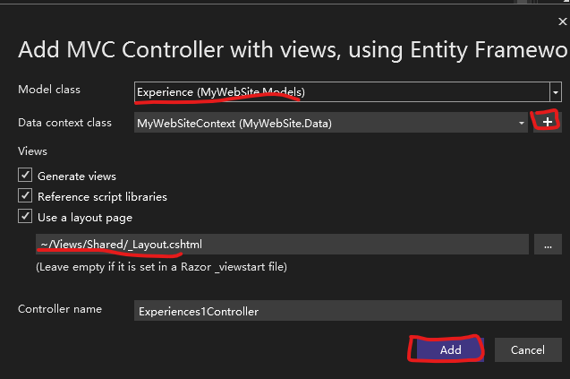

If you get an error message, select Add a second time to try it again.

Scaffolding updates the following:

- Inserts required package references in the MyWebSite.csproj project file.
- Registers the database context in the Program.cs file.
- Adds a database connection string to the appsettings.json file.

Scaffolding creates the following:

- A experiences controller: *Controllers/ExperiencesController.cs*
- Razor view files for Create, Delete, Details, Edit, and Index pages: Views/Experiences/*.cshtml
- A database context class: *Data/MyWebSiteContext.cs*

The automatic creation of these files and file updates is known as scaffolding.

The scaffolded pages can't be used yet because the database doesn't exist. Running the app and selecting the App link results in a Cannot open database or no such table: Experience error message.

## Work with Sqlite

### Initial migration

Use the EF Core Migrations feature to create the database. Migrations is a set of tools that create and update a database to match the data model.

- From the Tools menu, select NuGet Package Manager > Package Manager Console.
- In the Package Manager Console (PMC), enter the following commands:
  
  ```powershell
  Add-Migration InitialCreate
  Update-Database
  ```

- **Add-Migration InitialCreate**
  
  Generates a Migrations/{timestamp}_InitialCreate.cs migration file. The InitialCreate argument is the migration name. Any name can be used, but by convention, a name is selected that describes the migration. Because this is the first migration, the generated class contains code to create the database schema. The database schema is based on the model specified in the *MyWebSiteContext* class.

- **Update-Database**
  
  Updates the database to the latest migration, which the previous command created. This command runs the Up method in the *Migrations/{time-stamp}_InitialCreate.cs* file, which creates the database.

**Run** and go to *https://localhost:7177/Experiences*

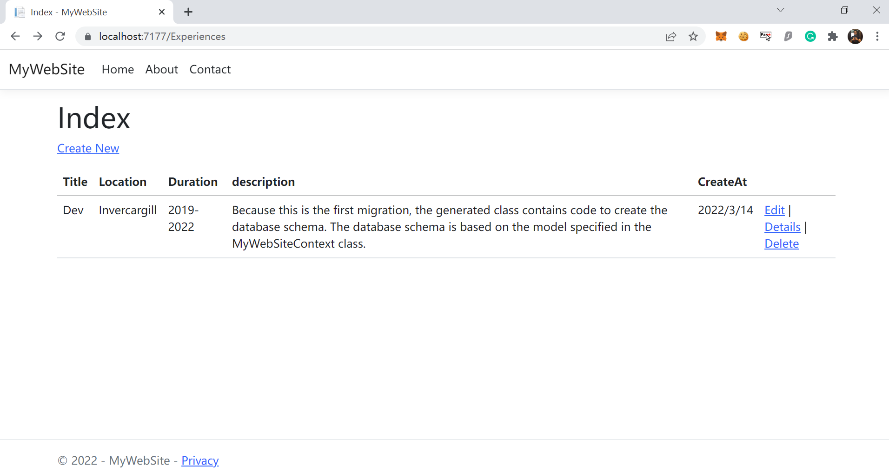

## Change the database

By default, scaffolding will automatically create a local SQL Server database. If you want to change to another database, such as SQLite. You can do as follows:

- Open file **Program.cs**, replace code
  
  ```cs
  builder.Services.AddDbContext<MyWebSiteContext>(options =>
    options.UseSqlServer(builder.Configuration.GetConnectionString("MyWebSiteContext")));
  ```

  to

  ```cs
  builder.Services.AddDbContext<MyWebSiteContext>(options =>
    options.UseSqlite(builder.Configuration.GetConnectionString("MyWebSiteContextSqlite")));
  ```

  For MySql

  ```cs
  builder.Services.AddDbContext<MyWebSiteContext>(options =>
    options.UseMySql(builder.Configuration.GetConnectionString("MyWebSiteContextMySQL"), new MySqlServerVersion(new Version(8, 0, 22))));
  ```

- Append following code to appsettings.json
  
  ```json
  "MyWebSiteContextSqlite": "Data Source=MyWebSite.db"
  ```

  *appsetting.json* should be

  ```json
  {
  "Logging": {
    "LogLevel": {
      "Default": "Information",
      "Microsoft.AspNetCore": "Warning"
    }
  },
  "AllowedHosts": "*",
  "ConnectionStrings": {
    "MyWebSiteContext": "Server=(localdb)\\mssqllocaldb;Database=MyWebSiteContext-4a237323-5d44-429f-9e73-50ff340e8428;Trusted_Connection=True;MultipleActiveResultSets=true",
    "MyWebSiteContextSqlite": "Data Source=MyWebSite.db",
    "MyWebSiteContextMySQL": "server=192.168.31.143;port=3306;database=db;uid=user;password=xxxxxx"
   }
  }
  ```

## Decorate templates

Next, use Bootstrap to beautify our page, you can try to change the page generated by this scaffolding to what you need.

## Try these yourself

The following is the article model, please try to use scaffolding to generate a corresponding controller **CRUD**.

Article.cs

```cs
using System.ComponentModel.DataAnnotations;

namespace MyWebSite.Models
{
    public class Article
    {
        public int Id { get; set; }
        
        [Required]
        public string? Title { get; set; }

        public string? Author { get; set; }

        [Required]
        public string? Body { get; set; }

        public string? Tags { get; set; }

        [DataType(DataType.Date)]
        public DateTime CreateAt { get; set; }
        
    }
}
```
