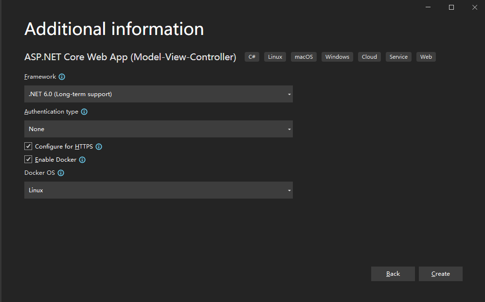
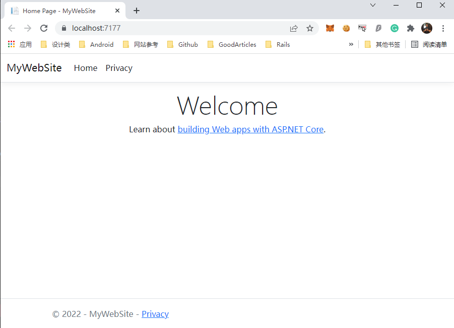
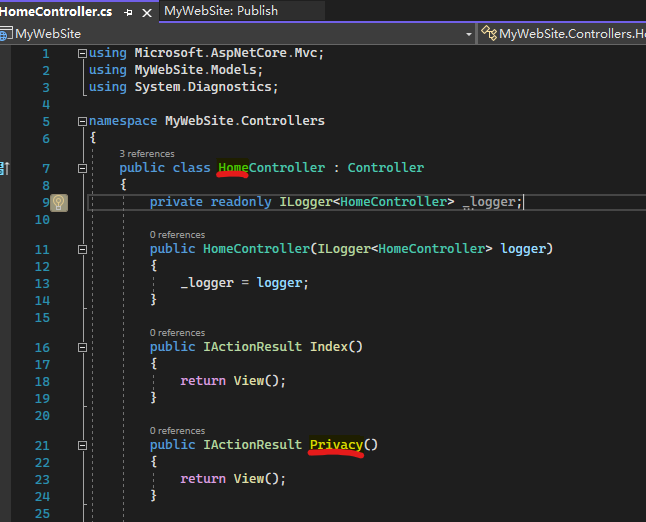

# Server-side App with .Net 6 and Sqlite

## 1. Intro

This doc teaches creating an ASP.NET Core MVC Web App with controllers and views. We will have an app that displays products.

**Objectives:**

- Create a web app with Visual Studio 2022
- Create Controller and View layers
- Using a model to work with databases (Sqlite or SqlServer)
- Upload files.

## 2. Prerequisites

- Visual Studio 2022
- SQLite Administrator

## 3. Create a new project

- Start Visual Studio and choose **Create a New Project**
- Select **ASP.NET Core Web App (Model-View-Controller)** and **Next**
- Project name: *MyWebSite*（name should be Camel-Case）and **Next**
- Framework: **.NET 6.0 (long-term support)** and check **Enable Docker**
- Create



- Change Run Mode from **Docker** to **MyWebSite** and **Run (F5)**


- See the result on the browser
  


## 4. New Page - add a controller

The Model-View-Controller (MVC) architectural pattern separates an app into three main components: Model, View, and Controller. The MVC pattern helps you create apps that are more testable and easier to update than traditional monolithic apps(Rick Anderson, 2022).

MVC-based apps contain:

- Models: Classes that represent the data of the app. The model classes use validation logic to enforce business rules for that data. Typically, model objects retrieve and store model state in a database. In this tutorial, a Movie model retrieves movie data from a database, provides it to the view or updates it. Updated data is written to a database.
- Views: Views are the components that display the app's user interface (UI). Generally, this UI displays the model data.
- Controllers: Classes that:
  - Handle browser requests.
  - Retrieve model data.
  - Call view templates that return a response.

In an MVC app, the view only displays information. The controller handles and responds to user input and interaction. For example, the controller handles URL segments and query-string values, and passes these values to the model. The model might use these values to query the database. For example:

**https://localhost:7177/Home/Privacy**: specifies the **Home** controller and the **Privacy** action.



### Add a controller

This section will build the controller for the **Contact** page.

- In Solution Explorer, right-click **Controllers** > **Add** > **Controller**.
  
- Choose MVC Controller - Empty > Add.
  
- Name: ContactController.cs
  

- Add following code after *Index()* method

```cs
        public string test()
        {
            return "test";
        }
```

- Run and Go to *https://localhost:7177/contact/test*
  

### update EF-tools

```bash
dotnet tool update --global dotnet-ef
```
