# Foreground app with .NET 6.0 MVC architecture (part 3) - Form

## 1. Intro

In previous tutorials, we have finished the list, single, and home page, and also have practiced with EF Core and database. So far every functionality works well, but one thing we did not cover is *Web Form*. according to the prototype, there is a contact page that needs a form to gather a message from visitors. In this tutorial, we are going to complete ContactController and views, furthermore, we are also going to create an admin panel for reviewing visitors' messages.

To see the prototype, please click [Prototype of MyWebSite Project](../Prototypes/MyWebSite/README.md)

## 2. Objectives

- Layout with Bootstrap
- Web Form with .NET Core 6
- Pagination
- Deployment with docker

## 3. Download the source code form Github.com

```bash
git clone https://github.com/jayinvers/MyWebSite.git MyWebSiteV2
cd MyWebSiteV2
git checkout tags/v0.1.1
```

Go to PM Console

```bash
update-database
```

Run the **project** and see the **result**

Online preview demo https://mywebsite.709.co.nz/

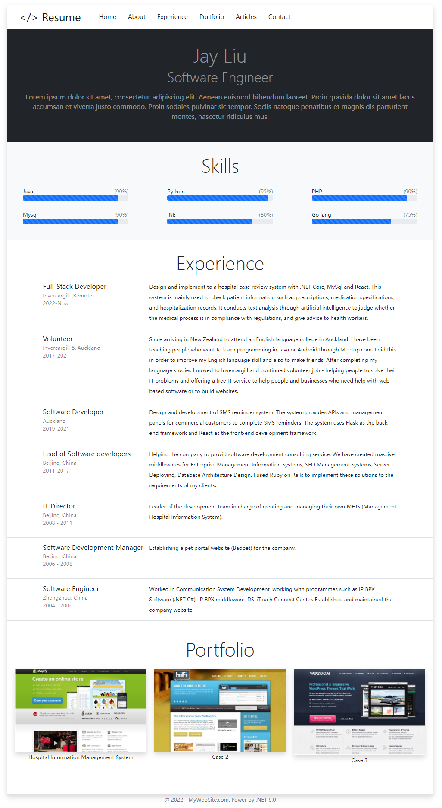

## 4. Complete the Contact page

The Contact page we are going to complete looks like this.
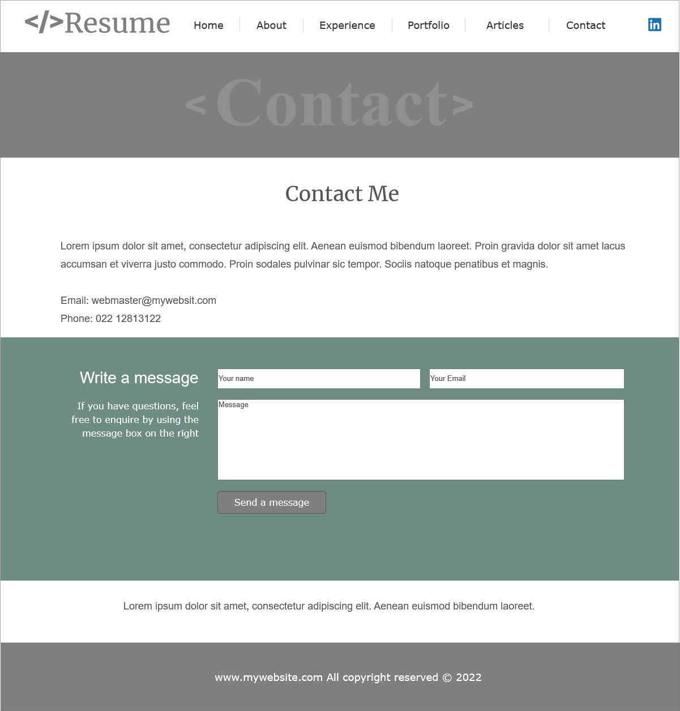

There are some text and a web form to submit a message from the visitor.

- Open file Views/Contact/Index.cshtml
  
  

  Firstly, we have to modify the text and add a form. Edit the html in the file to make it look like the image above.

```cshtml
@{
    ViewData["Title"] = "Contact Me";
    ViewData["Banner"] = "Contact";
}

<div class="row g-0 justify-content-md-center mb-5">
    <div class="col-9">
        <h1 class="text-center display-4"> @ViewData["Title"]</h1>
        <div class="content fs-4 lh-base">

            <p>Lorem ipsum dolor sit amet, consectetur adipiscing elit. Aenean euismod bibendum laoreet. Proin gravida dolor sit amet lacus accumsan et viverra justo commodo. Proin sodales pulvinar sic tempor. Sociis natoque penatibus et magnis dis parturient montes, nascetur ridiculus mus.</p>
            <p>If you have questions, feel free to send an email to me. </p>

            <p>Email: maxazure@gmail.com</p>
        </div>
    </div>
</div>

<div class="row g-0 pt-5 pb-5 fs-6 justify-content-md-center messagebox">
    <div class="col-3 text-white text-end lh-lg pe-3">
        <h1 class="fs-4">Write a message</h1>
        <p>If you have questions, feel free to enquire by using the message box on the right </p>
        <p>My profiles in social media</p>

    </div>
    <div class="col-6">
        <form asp-controller="Contact" asp-action="LeaveMessage" method="post">
            <div class="pb-4 pt-2 row g-0">
                <div class="form-floating col pe-4">
                    <input type="email" class="form-control" id="Email" name="Email" placeholder="name@example.com">
                    <label for="Email">Email address</label>
                </div>
                 <div class="form-floating col">
                    <input type="text" class="form-control" id="FullName" name="FullName" placeholder="Your Name">
                    <label for="FullName">Your Name</label>
                </div>
            </div>
            <div class="pb-4 form-floating">
                <textarea class="form-control" placeholder="Leave a comment here" id="Message" name="Message" style="height: 100px"></textarea>
                <label for="Message">Message</label>
            </div>
            <div class="pb-4"><button type="submit" class="btn btn-light text-uppercase">send a message</button></div>
        </form>
    </div>
</div>

```

- Next, We are going to add a new action for ContactController.cs
  
  use the following code

```cs
using Microsoft.AspNetCore.Mvc;

namespace MyWebSite.Controllers
{
    public class ContactController : Controller
    {
        
        public IActionResult Index()
        {
            return View();
        }
        [HttpPost]
        public string LeaveMessage(string fullName, string email, string message)
        {

            return $"A message from {FullName}, {email}, body: {message}";
        }
    }
}

```

- Run and submit a message to see the result

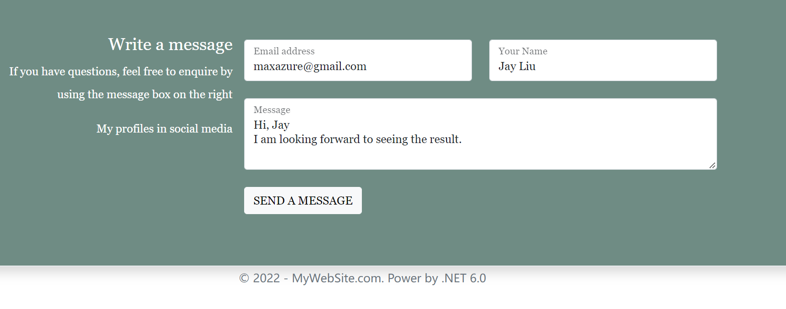

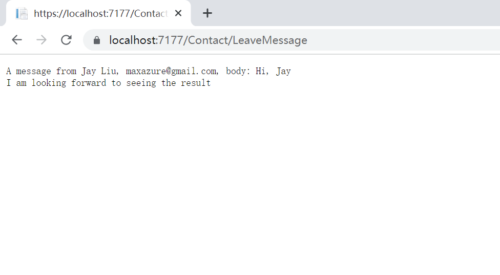

### Note. more information about ASP.NET Form Tag, please go to the link

https://docs.microsoft.com/en-us/aspnet/core/mvc/views/working-with-forms?view=aspnetcore-6.0

## 5. Create a model for store Messages to Database

So far, we have completed the layout of the Contact page and successfully submitted the data to the controller. Next, we will create a data table for the message to store the data permanently.

- Create *Message.cs* in **Models** folder
  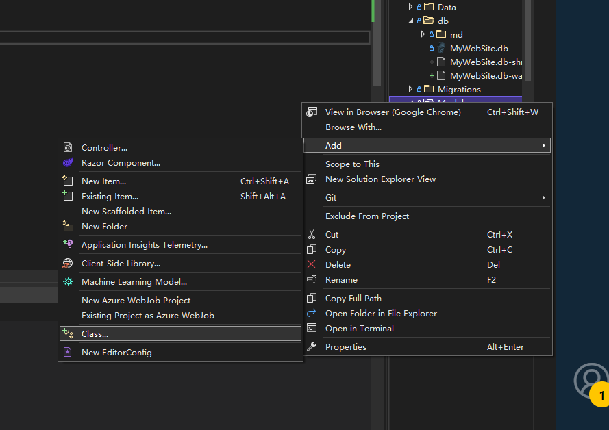

Models/Message.cs
```cs
using System.ComponentModel.DataAnnotations;
using System.ComponentModel.DataAnnotations.Schema;

namespace MyWebSite.Models
{
    public class Message
    {
        [Key]
        public int Id { get; set; }
        public string? Body { get; set; }

        [Required]
        public string? Email { get; set; }
        public string? FullName { get; set; }

       // [DatabaseGenerated(DatabaseGeneratedOption.Computed)]
        public DateTime CreatedAt { get; set; }

    }
}

```

- Add following code to Data/MyWebSiteContext.cs

```cs
  public DbSet<MyWebSite.Models.Message> Message { get; set; }
```

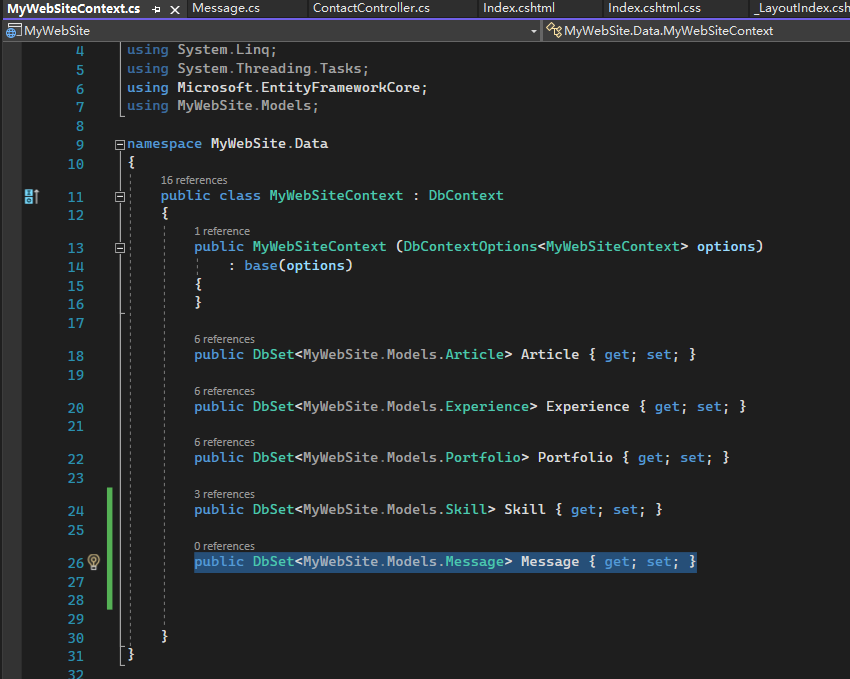

- Go to PM console

```bash
add-migration message
update-database
```

- Modify ContactController.cs

```cs
       [HttpPost]
        public string LeaveMessage(string fullName, string email, string message)
        {
            Message message1 = new Message();
            message1.FullName = fullName;
            message1.Email = email;
            message1.Body = message;
            message1.CreatedAt = DateTime.Now;
            _context.Message.Add(message1);
            try
            {
                _context.SaveChanges();
            }
            catch (Exception ex)
            {

                return $"Some thing went wrong.{ex.Message}";
            }
            ViewData["msg"] = $"A message from {fullName}, {email}, body: {message}. <br /> has been sent successfully.";
            return  ViewData["msg"];

        }
```

- Run and submit again
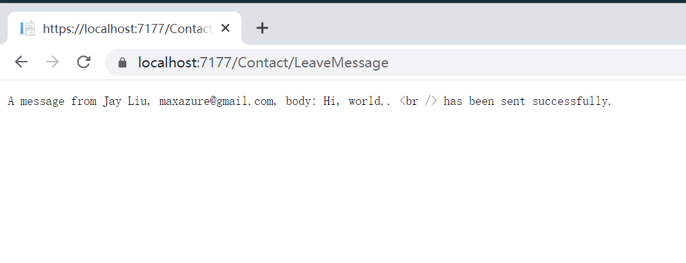

- Next, We are going to make a view page for LeaveMessage Action.

  Create a file **LeaveMessage.cshtml** in *Views/Contact/* folder

```cshtml
@{
    ViewData["Title"] = "Contact Me";
    ViewData["Banner"] = "Contact";
}

<div class="row g-0 justify-content-md-center mb-5">
    <div class="col-9">
        <h1 class="text-center display-4"> @ViewData["Title"]</h1>
        <div class="content fs-4 lh-base">

            <p class="fs-3 mb-5">@Html.Raw(ViewData["msg"])</p>
            <p>If you have questions, feel free to send an email to me. </p>

            <p>Email: maxazure@gmail.com</p>
        </div>
    </div>
</div>
```

- Modify  ContactController.cs

```cs
 [HttpPost]
        public IActionResult LeaveMessage(string fullName, string email, string message)
        {
            Message message1 = new Message();
            message1.FullName = fullName;
            message1.Email = email;
            message1.Body = message;
            message1.CreatedAt = DateTime.Now;
            _context.Message.Add(message1);
            try
            {
                _context.SaveChanges();
            }
            catch (Exception ex)
            {

                ViewData["msg"] = $"Some thing went wrong.{ex.Message}";
            }
            finally
            {
                ViewData["msg"] = $"A message from {fullName}, {email} has been sent successfully. <br /> Message Body: {message}";

            }
            
            return View();

        }
```

- Run and see the result

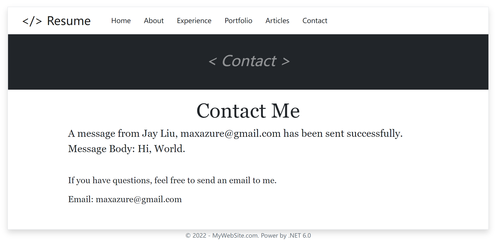

## 6. Create an admin panel to review visitors' messages

- Create new folder: Views/Admin
- Create new controller: Controller/AdminController.cs

```cs
#nullable disable
using System;
using System.Collections.Generic;
using System.Linq;
using System.Threading.Tasks;
using Microsoft.AspNetCore.Mvc;
using Microsoft.AspNetCore.Mvc.Rendering;
using Microsoft.EntityFrameworkCore;
using MyWebSite.Data;
using MyWebSite.Models;

namespace MyWebSite.Controllers
{
    public class AdminController : Controller
    {
        private readonly MyWebSiteContext _context;

        public AdminController(MyWebSiteContext context)
        {
            _context = context;
        }

        // GET: Admin/Messages
        public async Task<IActionResult> Messages()
        {
            return View(await _context.Message.ToListAsync());
        }

    }
}

```

- Create an Admin layout for Admin views

  Views/Shared/_LayoutAdmin.cshtml

```cshtml
@{
    ViewData["SiteName"] = "MyWebSite.com";
}
<!DOCTYPE html>
<html lang="en">
<head>
    <meta charset="utf-8" />
    <meta name="viewport" content="width=device-width, initial-scale=1.0" />
    <title>@ViewData["Title"] - MyWebSite Admin Panel</title>
    <link rel="stylesheet" href="~/lib/bootstrap/dist/css/bootstrap.min.css" />
    <link rel="stylesheet" href="~/css/site.css" asp-append-version="true" />
    <link rel="stylesheet" href="~/MyWebSite.styles.css" asp-append-version="true" />
</head>
<body>
    <div class="container shadow mt-4 p-0 border border-top">
        <header>
        <nav class="navbar navbar-expand-sm navbar-toggleable-sm navbar-light border-bottom bg-light">
            <div class="container">
                <a class="navbar-brand ms-4 me-5 fs-2" asp-area="" asp-controller="Admin" asp-action="Messages">&#60;/&#62; Admin Panel</a>
                <button class="navbar-toggler" type="button" data-bs-toggle="collapse" data-bs-target=".navbar-collapse" aria-controls="navbarSupportedContent"
                        aria-expanded="false" aria-label="Toggle navigation">
                    <span class="navbar-toggler-icon"></span>
                </button>
                <div class="navbar-collapse collapse d-sm-inline-flex justify-content-between">
                    <ul class="navbar-nav flex-grow-1">
                        <li class="nav-item">
                            <a class="nav-link text-dark" asp-area="" asp-controller="Admin" asp-action="Messages">Messages</a>
                        </li>


                    </ul>
                </div>
            </div>
        </nav>
    </header>
@RenderBody()
    </div>
      <footer class="lh-lg text-muted">
        <div class="container text-center">
            &copy; 2022 - @ViewData["SiteName"]. Power by .NET 6.0
        </div>
    </footer>  
    <script src="~/lib/jquery/dist/jquery.min.js"></script>
    <script src="~/lib/bootstrap/dist/js/bootstrap.bundle.min.js"></script>
    <script src="~/js/site.js" asp-append-version="true"></script>
    @await RenderSectionAsync("Scripts", required: false)
</body>
</html>

```

- Create a new view: Views/Admin/Messages.cshtml

```cshtml
@model IEnumerable<MyWebSite.Models.Message>

@{
    ViewData["Title"] = "Messages Review";
    Layout = "~/Views/Shared/_LayoutAdmin.cshtml";
}

<nav aria-label="breadcrumb">
    <ol class="breadcrumb ps-5 pt-2 pb-2 bg-light border-bottom">
        <li class="breadcrumb-item active" aria-current="page">Home / @ViewData["Title"]</li>
    </ol>
</nav>


@foreach (var item in Model)
{
    <div class="row justify-content-md-center lh-base">
        <div class="col-3">
            <ul class="list-unstyled">
                <li>@item.Id . @Html.DisplayFor(modelItem => item.FullName)</li>
                <li class="text-black-50">@Html.DisplayFor(modelItem => item.Email)</li>
                <li class="text-black-50">@Html.DisplayFor(modelItem => item.CreatedAt)</li>
            </ul>
        </div>
        <div class="col-8">@Html.DisplayFor(modelItem => item.Body)</div>
    </div>

}

```

- Run and go to https://localhost:7177/admin/messages to see the result
  
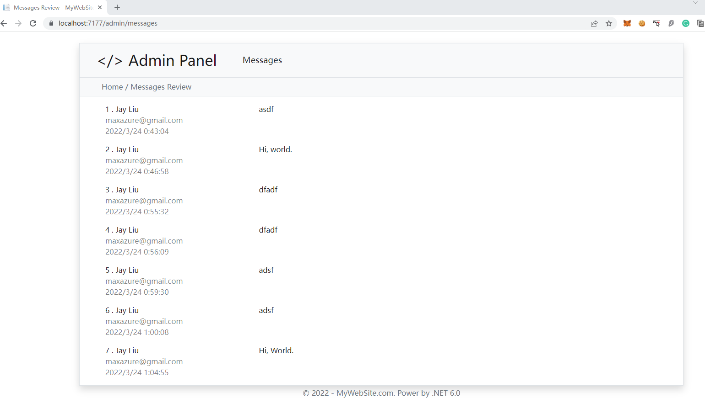

- We want the newest comments to come first, which requires some modification to the controller. The following code

```cs
#nullable disable
using System;
using System.Collections.Generic;
using System.Linq;
using System.Threading.Tasks;
using Microsoft.AspNetCore.Mvc;
using Microsoft.AspNetCore.Mvc.Rendering;
using Microsoft.EntityFrameworkCore;
using MyWebSite.Data;
using MyWebSite.Models;

namespace MyWebSite.Controllers
{
    public class AdminController : Controller
    {
        private readonly MyWebSiteContext _context;

        public AdminController(MyWebSiteContext context)
        {
            _context = context;
        }

        // GET: Admin/Messages
        public IActionResult Messages()
        {
            return View(_context.Message.OrderByDescending(x=>x.Id).ToList());
        }
    }
}
```

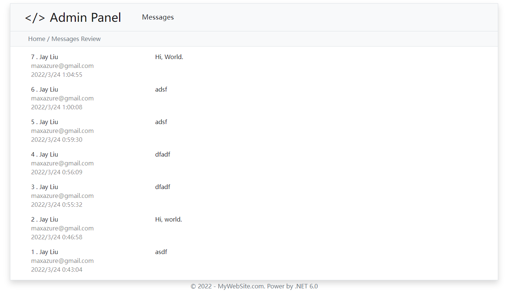


## 7. Pagination

Think about how to design a pagination by using SQL

 - **We have following important Variable**

```cs
// params
PageCurrent = 2
PageSize = 10
//-------------
TotalItems = 122
TotalPages = (TotalItems + PageSize - 1) / PageSize
Position = PageCurrent * PageSize

```

- pagination code (Example)

```cs
var position = 20;
var nextPage = context.Posts
    .OrderBy(b => b.PostId)
    .Skip(position)
    .Take(10)
    .ToList();
```

- Code of AdminController.cs
  
  **Note that** I wrote a piece of junk for ease of understanding. We will refactor the code in future lessons. **Never** write code like this in your **real project! ! !**

```cs
        public async Task<IActionResult> Messages(int page=1)
        {
            int pageIndex = page;
            int pageSize = 2;

            IQueryable<Message> messageIQ = from m in _context.Message select m;
            messageIQ = messageIQ.OrderByDescending(m => m.Id);

            int count = await messageIQ.CountAsync();
            int totalPages = (int)Math.Ceiling(count / (double)pageSize);

            messageIQ = messageIQ.Skip((pageIndex-1)*pageSize).Take(pageSize);

            ViewData["PaginationTotalPage"] = totalPages;
            ViewData["PaginationIndex"] = pageIndex;

            return View(await messageIQ.AsNoTracking().ToListAsync());
        }
```

## Try it yourself

Consider how to implement this pagination action in the view.

## 8. Deployment with docker

**Make sure** you have installed Docker for windows.

- Selecting the Debug mode to Docker
  
  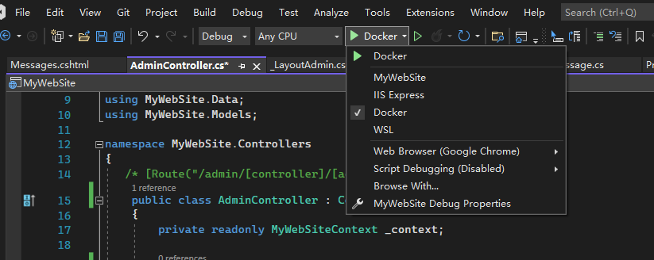

- Click MyWebSite Debug Properties
  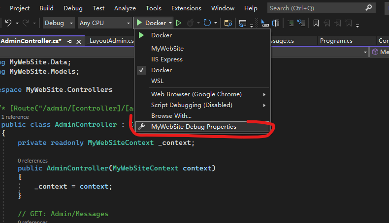
  
  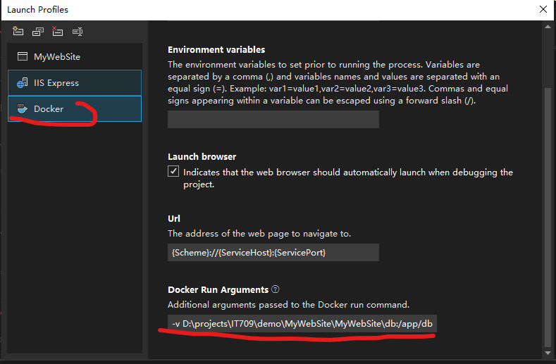

  The path should be

  ```bash
  # -v [your project dir]\MyWebSite\db:/app/db
  -v D:\projects\IT709\demo\MyWebSite\MyWebSite\db:/app/db
  ```

- Run the project with Docker
