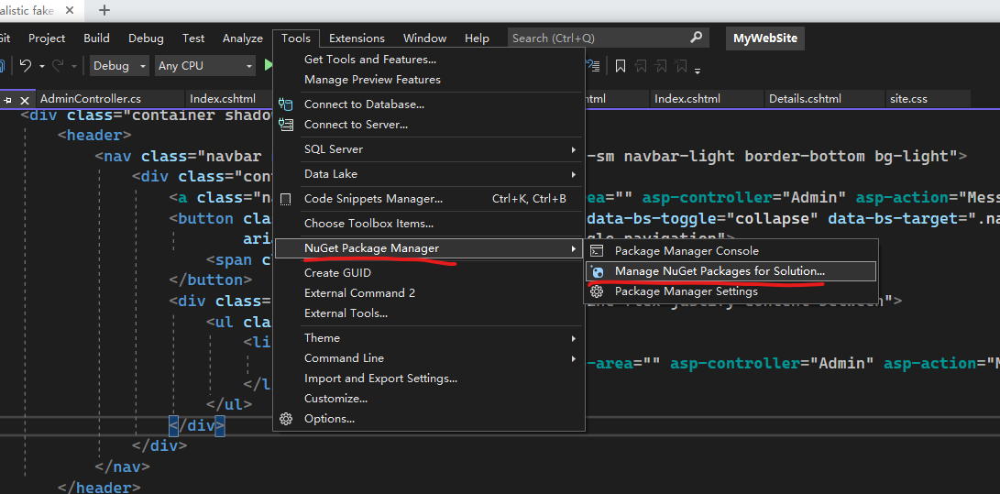
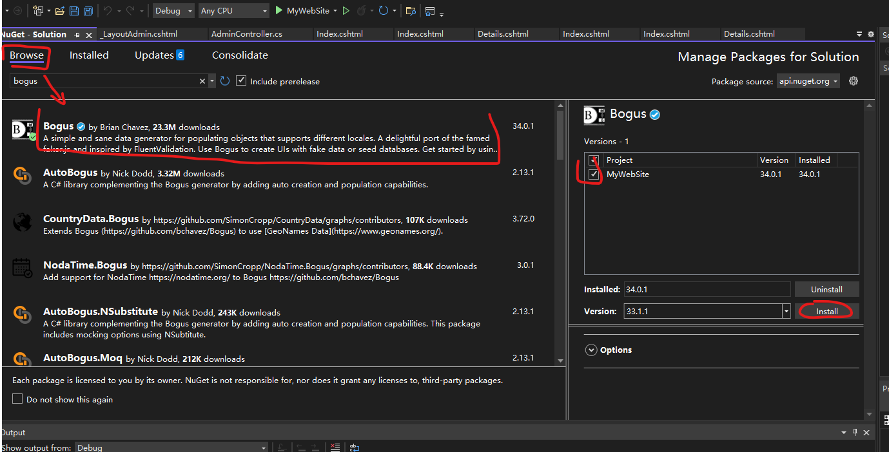

# Foreground app with .NET 6.0 MVC architecture (part 4) Code Refactor

## 1. Intro

So far, we have built a well-working foreground website. It works, but it still leaves a lot to be desired. Some **duplicated code**, **non-reusable** pagination, some **hardcoded** content of the website. When we review the code, we need to dive into the **requirement** to **rethink** its functionality.

**Code refactoring** should **always** be on our minds. Writing reusable code not only increases productivity but makes code more readable and clear.

Today, we will dive into code refactoring. I'm going to take an example with **Pagination**, then talk about how to split controller and model to make the code reusable.

## 2. Objectives

- Use Fake data generator to fill the testing database
- Understanding fundamental of pagination
- Refactoring pagination code
- Creating a pagination NuGet package for other project

## 3. Requirement

Last time, we worked on the Contact page to allow visitors could submit a message to the database. The problem is that visitors leave too many messages, and when we look at the list of messages in the admin panel, we could get confused and could not tell which one is processed or not. Furthermore, loading hundreds of comments at once may cause the page to load slow, we need pagination.

We plan to design two tabs to identify messages before and after processing. All processed messages will go to the Processed tab. And let each page display a maximum of 4 items.


## 4. Fake data generator

- open Manage NuGet Packages for Solution
  

- Install **Bogus** NuGet Packages
  

- Add a method to your SeedData.cs

  ```cs
  private static List<Message> FakeMessages(int count)
  {
      
      var messageFaker = new Faker<Message>()
          .RuleFor(m => m.Email, f => f.Person.Email)
          .RuleFor(m => m.FullName, f => f.Person.FullName)
          .RuleFor(m => m.Body, f => f.Lorem.Paragraph())
          .RuleFor(m => m.CreatedAt, f => f.Date.Past());
      return messageFaker.Generate(count);

  }
  ```

  In this code, we initial a new *Faker*, and specify rules for each property of Message.

  messageFaker.Generate(**count**) will returns a **List** containing the number **count** of Message objects.
  
- Do not forget to add IMPORT sentence.

  ```cs
  using Bogus;
  ```

- Add following code to *Initialize()*

  ```cs
  if (!context.Message.Any())
    context.Message.AddRange(FakeMessages(100));
  ```

- More information about Bogus https://github.com/bchavez/Bogus

## 5. Coding with pagination

```cs
// GET: Admin/Messages
public async Task<IActionResult> Messages(int page=1)
{
    int pageIndex = page;
    int pageSize = 10;

    IQueryable<Message> messageIQ = from m in _context.Message select m;
    messageIQ = messageIQ.OrderByDescending(m => m.CreatedAt);

    int count = await messageIQ.CountAsync();
    int totalPages = (int)Math.Ceiling(count / (double)pageSize);

    messageIQ = messageIQ.Skip((pageIndex-1)*pageSize).Take(pageSize);

    ViewData["PaginationTotalPage"] = totalPages;
    ViewData["PaginationIndex"] = pageIndex;

    return View(await messageIQ.AsNoTracking().ToListAsync()
}

```

## 6. Code Refactor

## 7. Make your frist NuGet package

## 8. conclusion
