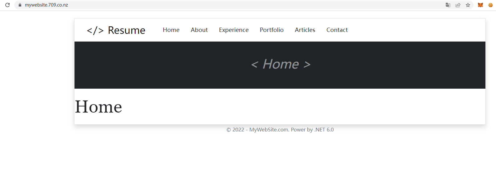
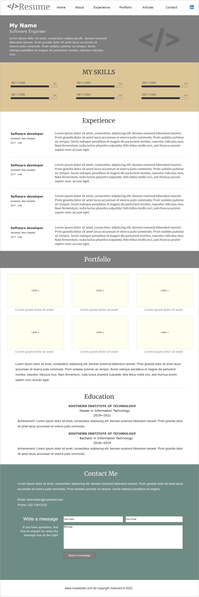

# Foreground app with .NET 6.0 MVC architecture (part 2) - Router and EF core

## 1. Intro

Last time, we made a simple resume website. In this tutorial, we will further improve it and explain in detail about Controllers, Views and EF Core related knowledge

To see the prototype, please click [Prototype of MyWebSite Project](../Prototypes/MyWebSite/README.md)


## 2. Objectives

- Use Bootstrap framework to design pages
- Learn the basic usage of EF Core (CRUD)
- Learn the controller and improve the HOME page
- Learn Route

## 3. Download the source code form Github.com

```bash
git clone https://github.com/jayinvers/MyWebSite.git
```

Run the **project** and see the **result**

Online preview demo https://mywebsite.709.co.nz/



## 4. Build the Home page

The home page we are going to build looks like this.


In the main area, there are 6 sections, About, Skills, Experience, Portflio, Education, Contact Me.

- Open file Views/Home/Index.cshtml
  
  

  First we start to modify the About section. Edit the html in the file to make it look like the image below.

  

- Next up is the Skills section. However, we don't need to create the Skill column in the menu. So this time we don't use scaffolding. Create the model manually.
  
  - Right Click the folder **Models** > **Add** > **Class**
  - File name is *Skill.cs*
  
  ```cs
  namespace MyWebSite.Models
    {
        public class Skill
        {
            public int Id { get; set; }
            public string Name { get; set; }
            public int Percentage { get; set; } 
        }
    }
  ```

  - Open *Data/MyWebSiteContext.cs* and edit
  
  ```cs
    #nullable disable
    using System;
    using System.Collections.Generic;
    using System.Linq;
    using System.Threading.Tasks;
    using Microsoft.EntityFrameworkCore;
    using MyWebSite.Models;

    namespace MyWebSite.Data
    {
        public class MyWebSiteContext : DbContext
        {
            public MyWebSiteContext (DbContextOptions<MyWebSiteContext> options)
                : base(options)
            {
            }

            public DbSet<MyWebSite.Models.Article> Article { get; set; }

            public DbSet<MyWebSite.Models.Experience> Experience { get; set; }

            public DbSet<MyWebSite.Models.Portfolio> Portfolio { get; set; }

            public DbSet<MyWebSite.Models.Skill> Skill { get; set; }
        }
    }
  ```

- Open Package Manager Console and type
  
  ```bash
  add-migration skill
  update-database
  ```

- Open **Models/SeedData.cs** and following code to **class SeedData**

```cs
 private static Skill[] addSkill()
        {
            return new Skill[]
            {
                new Skill
                {
                    Name = "Java",
                    Percentage = 90
                },
                new Skill
                {
                    Name = "Python",
                    Percentage = 95
                },
                new Skill
                {
                    Name = "PHP",
                    Percentage = 90
                },
                new Skill
                {
                    Name = "Mysql",
                    Percentage = 90
                },
                new Skill
                {
                    Name = ".NET",
                    Percentage = 80
                },
                new Skill
                {
                    Name = "Go lang",
                    Percentage = 75
                },
            };
        }
```

  And add following code to **Initialize()**

```cs
                if (!context.Skill.Any())
                    context.Skill.AddRange(addSkill());
```

- Del the database: db/MyWebSite.db and re-generate the database in PM

```bash
update-database
```

- Next, in order to pass multiple Models into the controller, we need to create a ListModel class.
  
  Create Models/ListModel.cs

```cs
namespace MyWebSite.Models
{
    public class ListModel
    {
        public IList<Article> ArticleModel { get; set; }
        public IList<Portfolio> PortfolioModel { get; set; }
        public IList<Experience> ExperienceModel { get; set; }
        public IList<Skill> SkillModel { get; set; }


    }
}
```

- Open file Controllers/HomeController.cs

```cs
using Microsoft.AspNetCore.Mvc;
using MyWebSite.Models;
using System.Diagnostics;
using Microsoft.EntityFrameworkCore;
using MyWebSite.Data;

namespace MyWebSite.Controllers
{
    public class HomeController : Controller
    {
  
        private readonly MyWebSiteContext _context;

        public HomeController(MyWebSiteContext context)
        {

            _context = context;
        }

        public async Task<IActionResult> Index()
        {
            var model = new ListModel();
            model.SkillModel = await _context.Skill.ToListAsync();
            model.ArticleModel = await _context.Article.ToListAsync();
            model.ExperienceModel = await _context.Experience.ToListAsync();
            model.PortfolioModel = await _context.Portfolio.ToListAsync();
            return View(model);
        }

        [ResponseCache(Duration = 0, Location = ResponseCacheLocation.None, NoStore = true)]
        public IActionResult Error()
        {
            return View(new ErrorViewModel { RequestId = Activity.Current?.Id ?? HttpContext.TraceIdentifier });
        }

    }
}
```

- Open the file Views/Home/index.cshtml

```cshtml
@model MyWebSite.Models.ListModel
@{
    ViewData["Title"] = "Home Page";
    ViewData["Banner"] = "Home";
}

<div>
    <h1 class="display-4">Home</h1>

    @foreach (var item in Model.SkillModel) {

<ul>
    <li>@Html.DisplayFor(modelItem => item.Name), @Html.DisplayFor(modelItem => item.Percentage)%</li>
</ul>
}

    @foreach (var item in Model.PortfolioModel) {

            <div class="row item justify-content-md-center mb-5 lh-base">
                <div class="col-3">
                    <ul class="list-unstyled">
                        <li></li>
                        <li class="fs-6 lh-lg text-center">@Html.DisplayFor(modelItem => item.Title)</li>
                    </ul>
                </div>
                <div class="col-7 fs-6">@Html.DisplayFor(modelItem => item.Description)</div>
            </div>
}

</div>
```

See the result.


## Try it yourself

- Design rest of **Home** page with Bootstrap
- Add new list section in Home (Portfolio)
- Read data in SeedData.cs form MarkDown files.

