# Foreground app with .NET 6.0 MVC architecture (part 4) Code Refactor

## 1. Intro

So far, we have built a well-working foreground website. It works, but it still leaves a lot to be desired. Some **duplicated code**, **non-reusable** pagination, some **hardcoded** content of the website. When we review the code, we need to dive into the **requirement** to **rethink** its functionality.

**Code refactoring** should **always** be on our minds. Writing reusable code not only increases productivity but makes code more readable and clear.

Today, we will dive into code refactoring. I'm going to take an example with **Pagination**, then talk about how to split controller and model to make the code reusable.

## 2. Objectives

- Use Fake data generator to fill the testing database
- Understanding fundamental of pagination
- Refactoring pagination code
- Creating a pagination NuGet package for other project

## 3. Requirement

Last time, we worked on the Contact page to allow visitors could submit a message to the database. The problem is that visitors leave too many messages, and when we look at the list of messages in the admin panel, we could get confused and could not tell which one is processed or not. Furthermore, loading hundreds of comments at once may cause the page to load slow, we need pagination.

We plan to design two tabs to identify messages before and after processing. All processed messages will go to the Processed tab. And let each page display a maximum of 4 items.

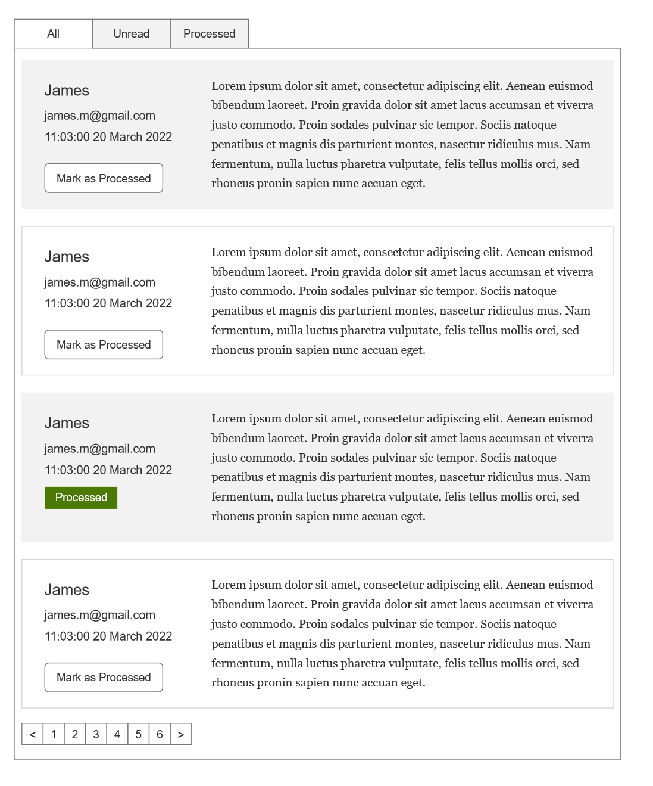

## 4. Fake data generator

- open Manage NuGet Packages for Solution
  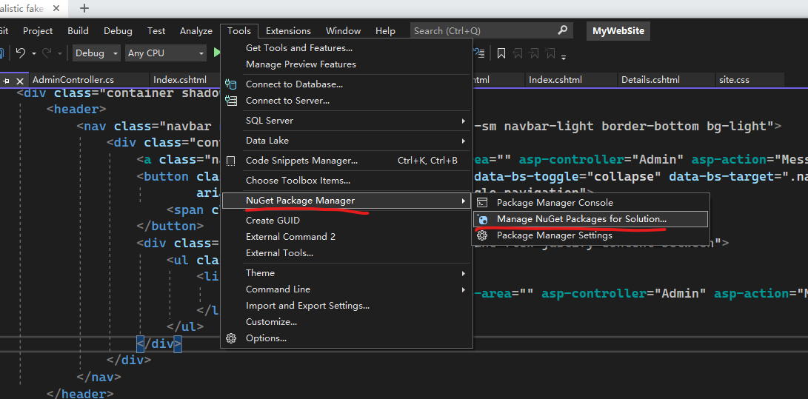

- Install **Bogus** NuGet Packages
  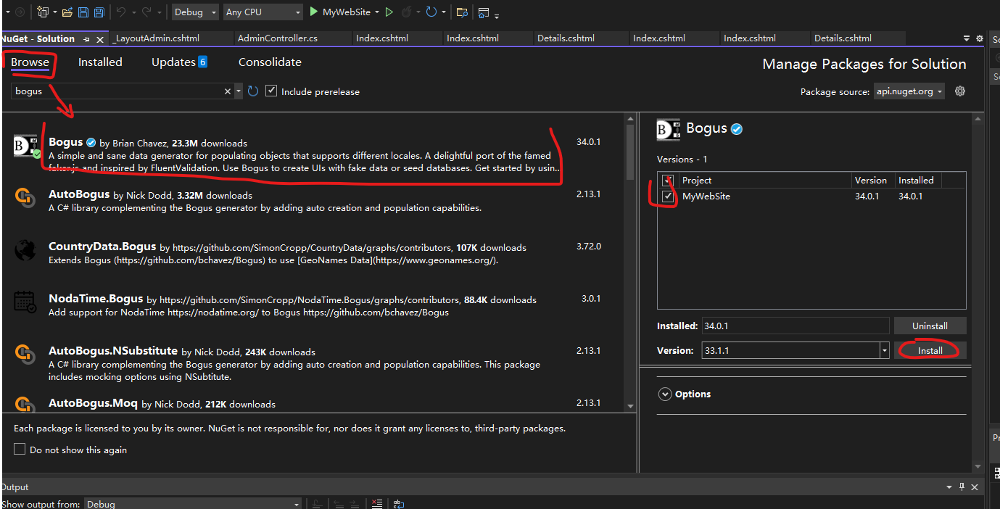

- Add a method to your SeedData.cs

  ```cs
  private static List<Message> FakeMessages(int count)
  {
      
      var messageFaker = new Faker<Message>()
          .RuleFor(m => m.Email, f => f.Person.Email)
          .RuleFor(m => m.FullName, f => f.Person.FullName)
          .RuleFor(m => m.Body, f => f.Lorem.Paragraph())
          .RuleFor(m => m.CreatedAt, f => f.Date.Past());
      return messageFaker.Generate(count);

  }
  ```

  In this code, we initial a new *Faker*, and specify rules for each property of Message.

  messageFaker.Generate(**count**) will returns a **List** containing the number **count** of Message objects.
  
- Do not forget to add IMPORT sentence.

  ```cs
  using Bogus;
  ```

- Add following code to *Initialize()*

  ```cs
  if (!context.Message.Any())
    context.Message.AddRange(FakeMessages(100));
  ```

- More information about Bogus https://github.com/bchavez/Bogus

## 5. Coding with pagination

Pagination is generally a common task for any web application. Robust pagination plugins are often used in commercial projects to accomplish this task. In today's lesson, we'll manually build the code into the controller, then improve (refactor) the code, and finally separate this pagination code from the project and make it a NuGet package for easy reuse in the future in the project.

Additionally, we will use another third-party NuGet package to reimplement pagination.

If you got any problem, or stucked in some issues. You can download the code from following link.

```bash
https://github.com/jayinvers/MyWebSite/releases/tag/v0.1.2
```

and Download **Source Code (zip)** and **run** the project

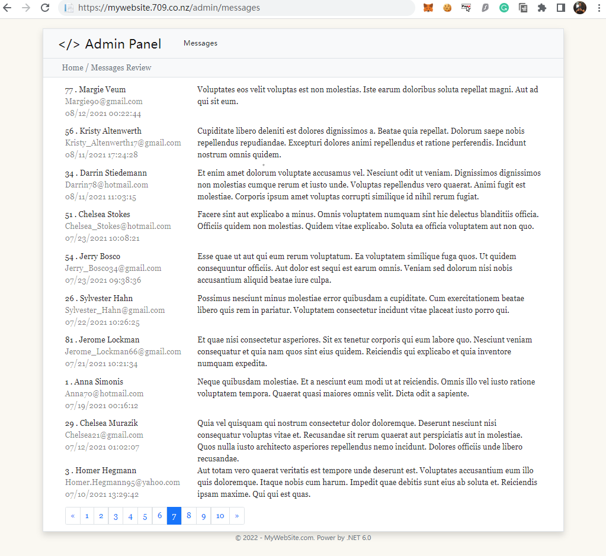

### The fundamental of paging

Examine the file controller/AdminController.cs

And find following line

```cs
// GET: Admin/Messages
public async Task<IActionResult> Messages(int page=1)
{
    int pageIndex = page;
    int pageSize = 10;


    IQueryable<Message> messageIQ = from m in _context.Message select m;
    

    int count = await messageIQ.CountAsync();
    ViewData["PaginationTotalPage"] = (int)Math.Ceiling(count / (double)pageSize);
    ViewData["PaginationIndex"] = pageIndex;

    
    messageIQ = messageIQ.OrderByDescending(m => m.CreatedAt)
        .Skip((pageIndex-1)*pageSize)
        .Take(pageSize);

    return View(await messageIQ.AsNoTracking().ToListAsync());
}

```

Pagination is fundamentally a process of constructing SQL query strings.

Let's take an example. First, according to the current Message table, we use the SQLite tool to perform manual paging simulation. (DB Browser for SQLite)

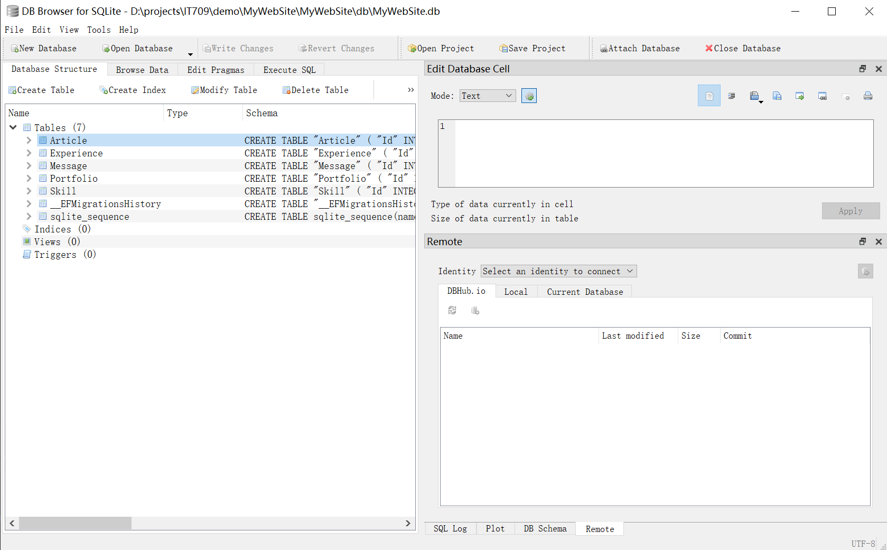

Try the SQL sentence following

```sql
SELECT * FROM Message
```

We will get 100 rows of Message item.

Next, we are going to get the first page.

The url would be *https://mywebsite.709.co.nz/admin/messages?page=1*

```sql
SELECT * FROM Message order by CreatedAt DESC LIMIT 10 OFFSET 0;
```

page 2

```sql
SELECT * FROM Message order by CreatedAt DESC LIMIT 10 OFFSET 10;
```

As we can see, changing the page number simply changes the number after **OFFSET**

```sql
SELECT * FROM Message order by CreatedAt DESC LIMIT PageSize OFFSET ((PageIndex-1) * PageSize);
```

Now let's implement it in .Net Core. This SQL statement corresponds to the following code.

```cs
IQueryable<Message> messageIQ = from m in _context.Message select m;

messageIQ = messageIQ.OrderByDescending(m => m.CreatedAt)
    .Skip((pageIndex-1)*pageSize)
    .Take(pageSize);
```

Next, we are going to work on the view file.

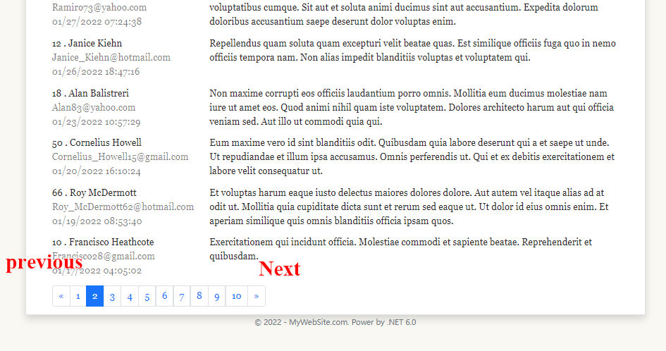

open the file Views/Admin/Messages.cshtml

```aspx-cs
<div class="row justify-content-md-center lh-base">
    <div class="col-11">
        <nav aria-label="Page navigation">
            <ul class="pagination">

                @if ((int)ViewData["PaginationIndex"] > 1)
                {
                    <li class="page-item">
                        <a class="page-link" href="?page=@((int)ViewData["PaginationIndex"]-1)" aria-label="Previous">
                            <span aria-hidden="true">&laquo;</span>
                        </a>
                    </li>
                }
                else
                {
                    <li class="page-item disabled">
                        <a class="page-link">&laquo;</a>
                    </li>
                }

                </li>
                @for (var i = 1; i < (int)ViewData["PaginationTotalPage"] + 1; i++)
                {
                    if ((int)ViewData["PaginationIndex"] == i)
                    {
                        <li class="page-item active" aria-current="page">
                            <a class="page-link" href="#">@i</a>
                        </li>
                    }
                    else
                    {
                        <li class="page-item"><a class="page-link" href="?page=@i">@i</a></li>
                    }

                }

                @if ((int)ViewData["PaginationIndex"] < (int)ViewData["PaginationTotalPage"])
                {
                    <li class="page-item">
                        <a class="page-link" href="page=@((int)ViewData["PaginationIndex"]+1)" aria-label="Next">
                            <span aria-hidden="true">&raquo;</span>
                        </a>
                    </li>
                }
                else
                {
                    <li class="page-item disabled">
                        <a class="page-link">&raquo;</a>
                    </li>
                }

            </ul>
        </nav>
    </div>

</div>
```

## 6. Code Refactor

Code refactoring is essential for every developer. It helps us reconsider the requirement so as to build a robust system, and also gives us a chance to review whether the code could be reused or not.
In this step, we are going to review our requirement, and plan to create common libraries or modules for other classes or programs.

Please pay attention to the navigation bar, where lies three items: experience, portfolio and articles.  The pages linked by them contain a list under which a **pagination control** is required. Further, we can imagine that we have the same needs in other similar projects.

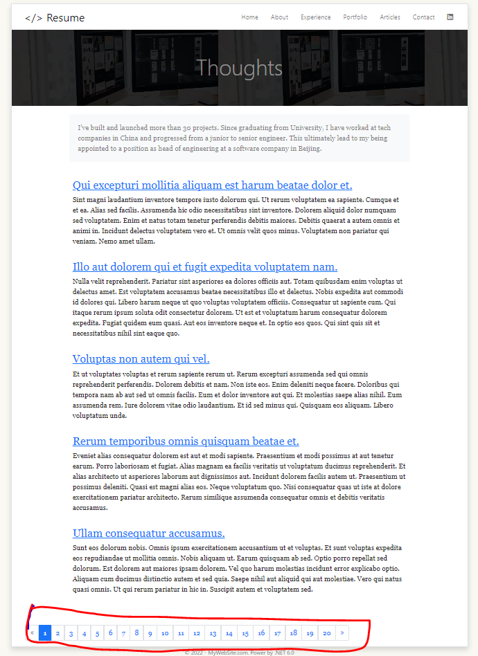

- New Requirement: **Make a reusable pagination**

Creat new model for pagination

Models/PagedList.cs

```cs
using Microsoft.EntityFrameworkCore;

namespace MyWebSite.Models;

public class PagedList<T> : List<T>
{
    public int PageIndex { get; private set; }
    public int TotalPages { get; private set; }
    public bool HasPreviousPage => PageIndex > 1;
    public bool HasNextPage => PageIndex < TotalPages;


    public PagedList(List<T> items, int count, int pageIndex, int pageSize)
    {
        PageIndex = pageIndex;
        TotalPages = (int)Math.Ceiling(count / (double)pageSize);

        this.AddRange(items);
    }

    public static async Task<PagedList<T>> CreateAsync(IQueryable<T> source, int pageIndex, int pageSize)
    {
        var count = await source.CountAsync();
        var items = await source.Skip(
            (pageIndex - 1) * pageSize)
            .Take(pageSize)
            .ToListAsync();
        return new PagedList<T>(items, count, pageIndex, pageSize);
    }

}
```

Moreover, We need a partial page for **view** part.

Views/Shared/_paging.cshtml

```html
<div class="row justify-content-md-center lh-base">
    <div class="col-11">
        <nav aria-label="Page navigation">
            <ul class="pagination">

                @if (Model.HasPreviousPage)
                {
                    <li class="page-item">
                        <a class="page-link" href="?page=@(Model.PageIndex-1)" aria-label="Previous">
                            <span aria-hidden="true">&laquo;</span>
                        </a>
                    </li>
                }
                else
                {
                    <li class="page-item disabled">
                        <a class="page-link">&laquo;</a>
                    </li>
                }

                </li>
                @for (var i = 1; i < Model.TotalPages + 1; i++)
                {
                    if (Model.PageIndex == i)
                    {
                        <li class="page-item active" aria-current="page">
                            <a class="page-link" href="#">@i</a>
                        </li>
                    }
                    else
                    {
                        <li class="page-item"><a class="page-link" href="?page=@i">@i</a></li>
                    }

                }

                @if (Model.HasNextPage)
                {
                    <li class="page-item">
                        <a class="page-link" href="page=@(Model.PageIndex+1)" aria-label="Next">
                            <span aria-hidden="true">&raquo;</span>
                        </a>
                    </li>
                }
                else
                {
                    <li class="page-item disabled">
                        <a class="page-link">&raquo;</a>
                    </li>
                }

            </ul>
        </nav>
    </div>

</div>
```

Next, we need to use them in the controller.

For example:

Controllers/ArticlesController.cs

```cs
// GET: Articles
public async Task<IActionResult> Index(int page=1)
{
    int pageSize = 5;
    IQueryable<Article> articleIQ = from m in _context.Article select m;
    articleIQ = articleIQ.OrderByDescending(m => m.Id);

    PagedList<Article> articles = await PagedList<Article>.CreateAsync(articleIQ, page, pageSize);

    return View(articles);
}
```

And use the Partial tag in View

Views/Articles/index.cshtml

```html
<partial name="_Paging" />
```

We can do more, separate it from the project and prepare it for other projects.

- Create a new project in the solution

  Right-Click **Solution** -> **Add** -> **New Project**

  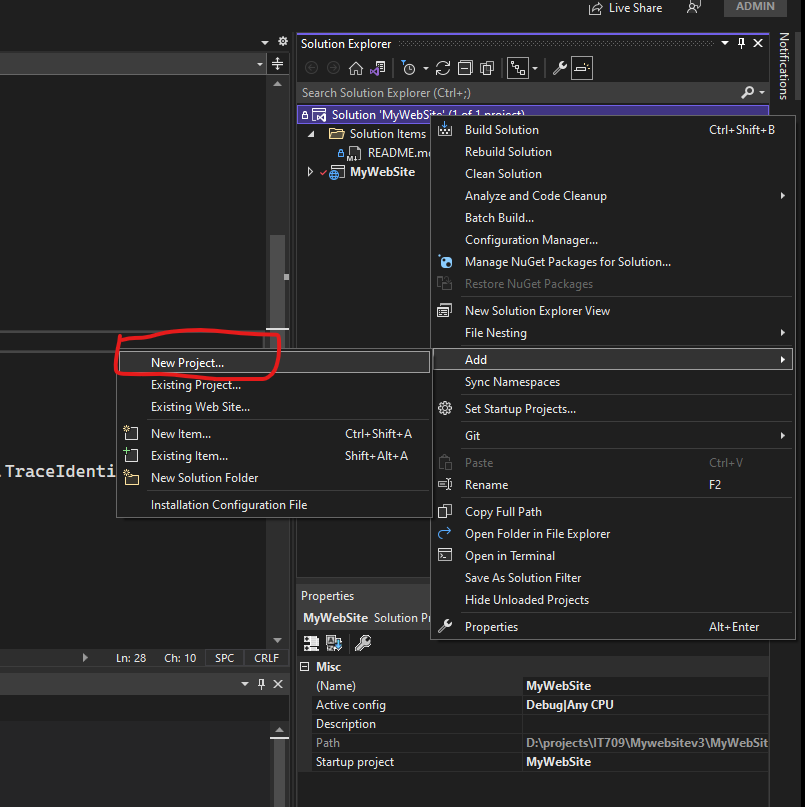

- choose **Class Library**
  
  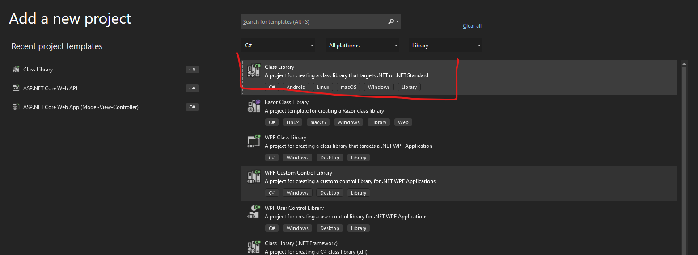

- And give a name(any name you want)
  
  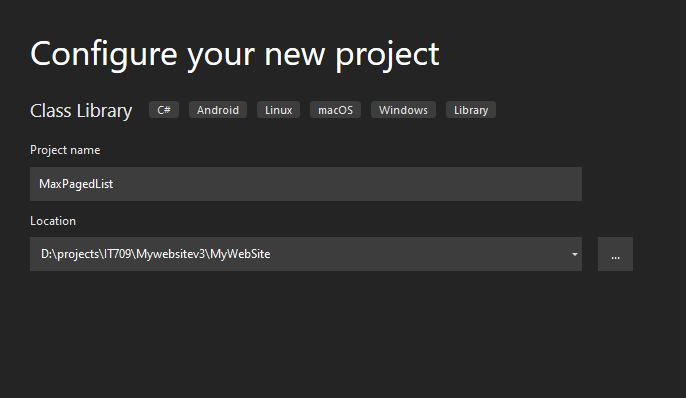

- Choose the framework version => **.NET 6.0(Long-term support)** and **Create**

- Rename Class1.cs to PagedList.cs

- Copy PagedList.cs from project **MyWebSite** to **MaxPagedList**

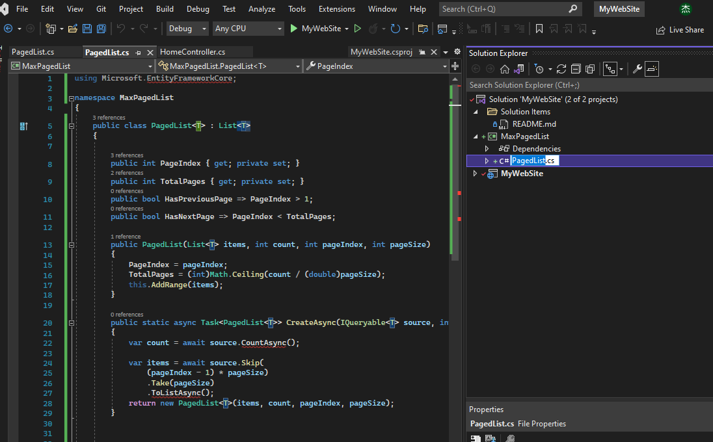

- Install EF Core to new project by using NuGet
  
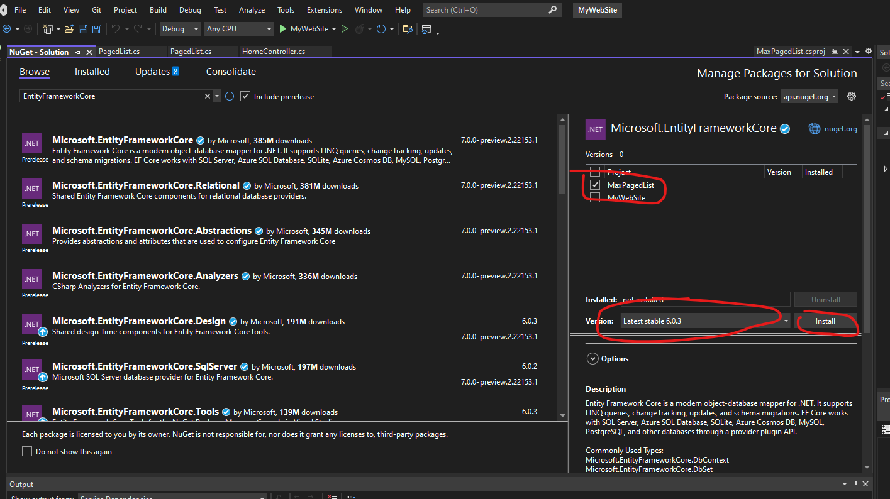

So far, we have build a new lib, and it is ready to use in other projects.

- Right-Click **MyWebSite**
  
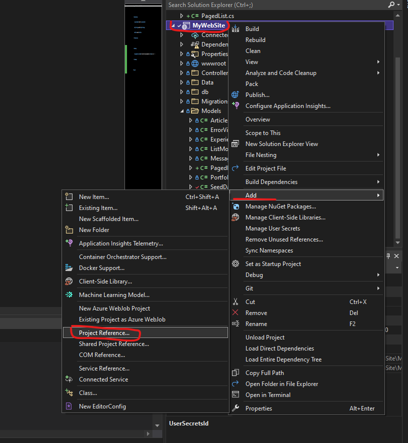

- Click checkbox of the project name

- Now we can use MaxPagedList.PagedList Class for new project

## 7. Make your frist NuGet package

- Configure your NuGet package, and **Pack**

- publish your NuGet to NuGet Server
  
  dotnet nuget push MaxPagedList.1.0.0.nupkg --api-key [your api key] --source https://repository.jayliu.co.nz/repository/nuget-hosted

### Try it yourself

- Deploy to Docker container.
- Modify all listing pages and add pagination.
- Create a SinglePage Model so as to let users can customize the content of each page, such as About.
- Try to create an Admin panel without permissions and authentication, and he can modify the contents of the front desk. And think about its solution directory structure.

## 8. conclusion

Our project is almost complete and it's time for a conclusion. We built a website project, which is a Foreground application based on the MVC architecture, using the following key points:

- Database connection method
- Model
- Controller
- Routing
- How to write cshtml and Partial
- Scaffolding generation
- SeedData and Fake data filling
- Pagination and code separation
- Linq and SQL
- NuGet package creation and publication
- Bootstrap (layout, m, p, grid, flex, icon)
- Deploy with Docker

What we still need to do:

- Create admin panel
- Authorization and Authentication
- Create a program template to prepare for the next project

## 9. Future works

- Consider how you could adapt this project as a template for rapid development, such as a new, different style resume website in under 4 hours.
- Consider how you can change page template layout and content without recompiling.
