# 08 Fundamental of Deployment

## 1. Deploy a static website with windows IIS

In this section we will show how to host a static website(based on HTML) on an IIS server.

> assuming the host OS is windows server 2019

- Install a windows server on a VM
  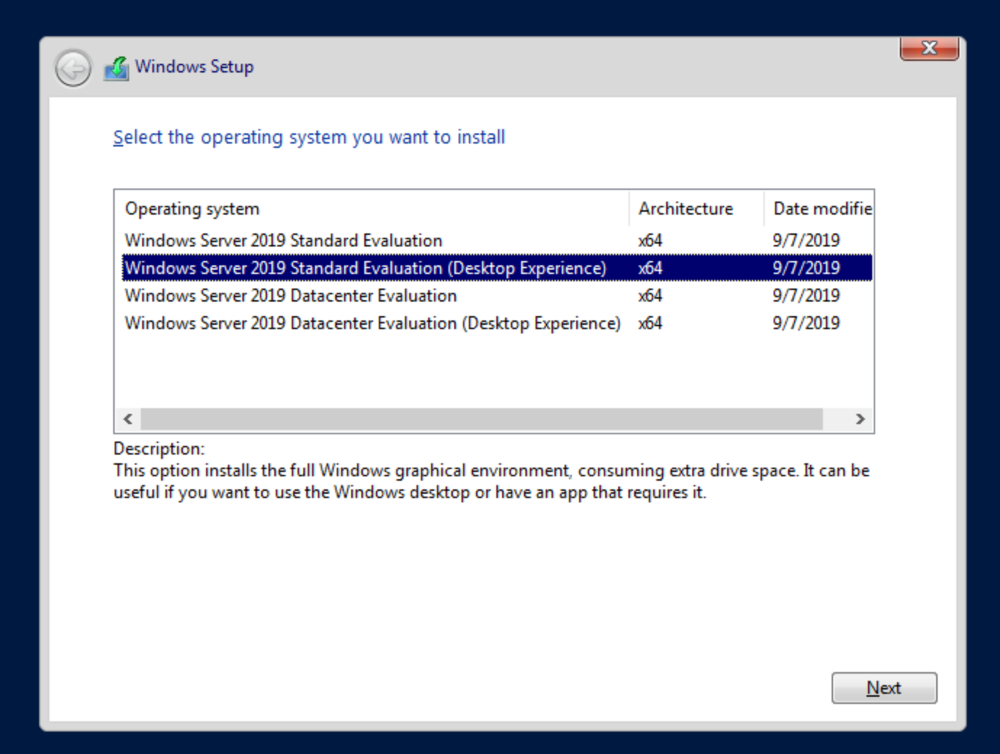
  Choose the option "Windows server 2019 standard evaluation(Desktop Experience)" if you are first to use Windows server.

- Install IIS server
  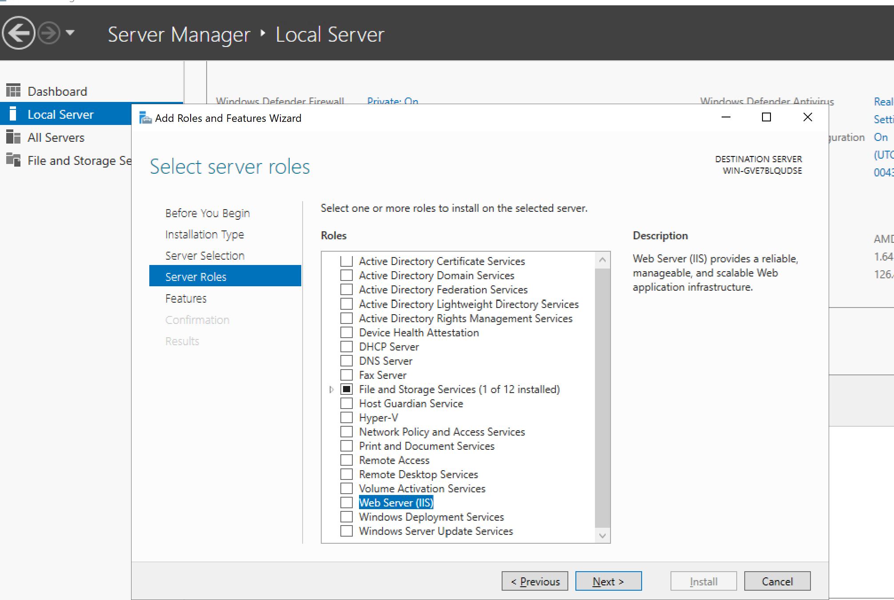
  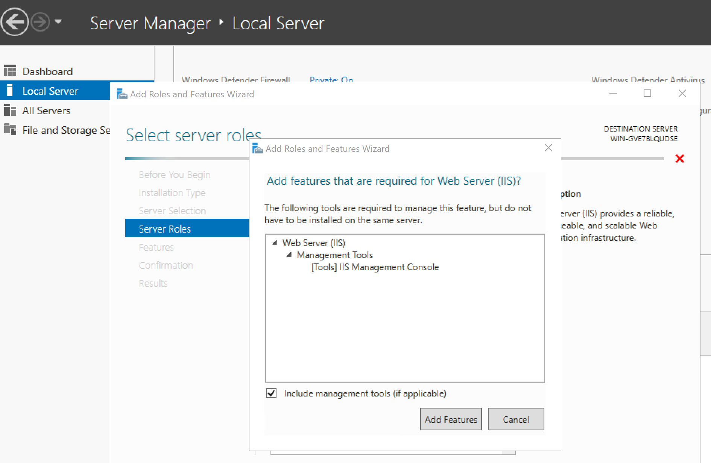

- Open IIS management
  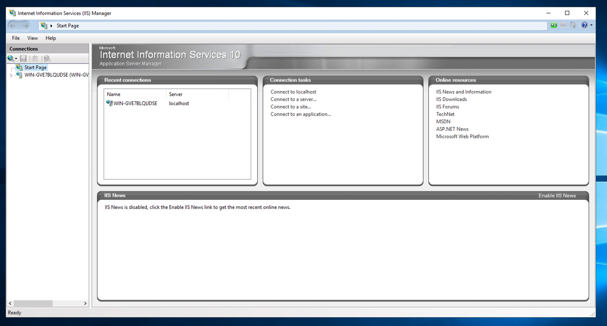
- Click the Host name > delete the default site
  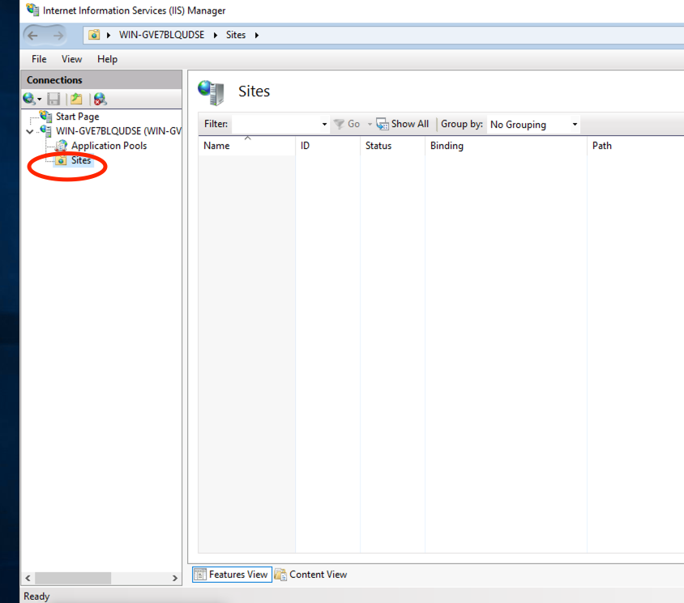
- Create a new folder named **Sites** in the user's home folder.
- Create a new folder named **MyHtmlPages** in Sites folder.
  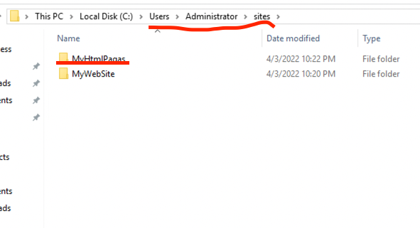
- Create a new HTML file **index.html**
  
  ```html
  <!doctype html>
  <html lang="en">
  <head>
    <meta charset="utf-8">
    <meta name="viewport" content="width=device-width, initial-scale=1">
    <title>Hello, My Website</title>
    <meta name="description" content="A simple HTML5 Template for new projects.">
    <meta name="author" content="SitePoint">
  </head>

  <body>
    Hi, this is my first web page I have deployed.
  </body>
  </html>

  ```

- Go to IIS management, right click **Sites** > **Add Website**
  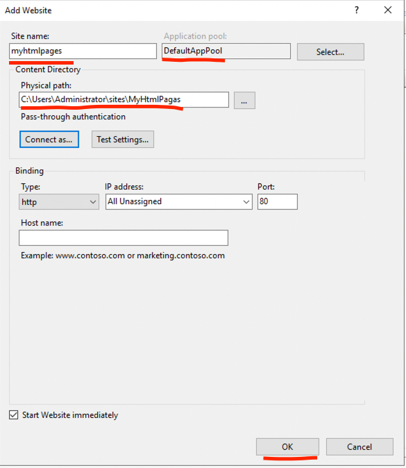
- When you go to browser to view <http://localhost/>, you probably will get a 401.3 Unauthorized Error page. that means we have to manually change the permission of the folder.
  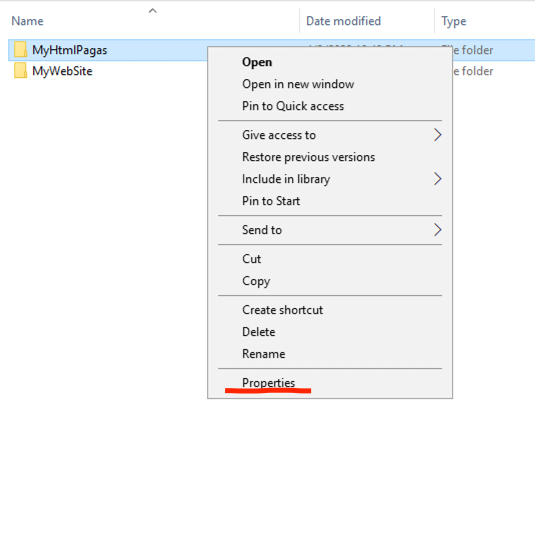
  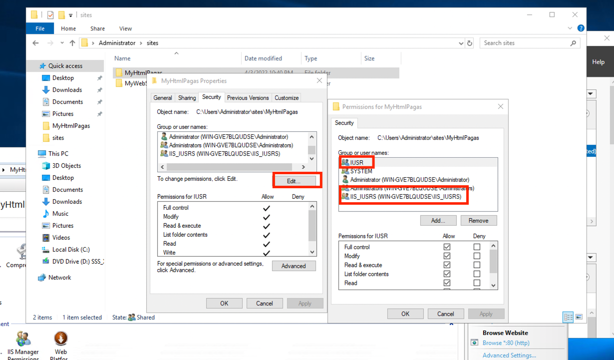
  **IIS_IUSRS** and **IUSR** account you **must** authorize.
- open your browser, to visit <http://localhost/>
  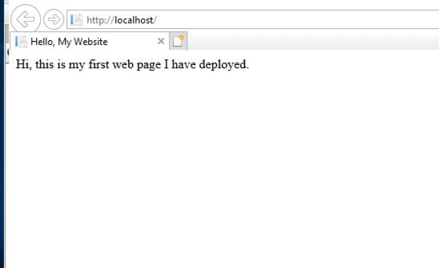

## 2. Deploy a dynamic web application with IIS(.Net 6)

- open VS 2022, and click **Build** > **Publish MyWebSite**
  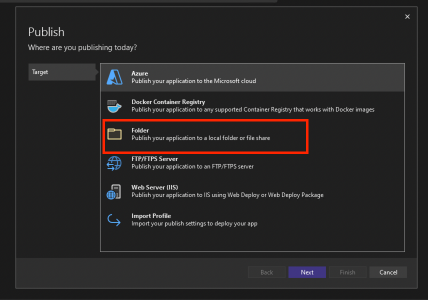
- copy the path of Folder
  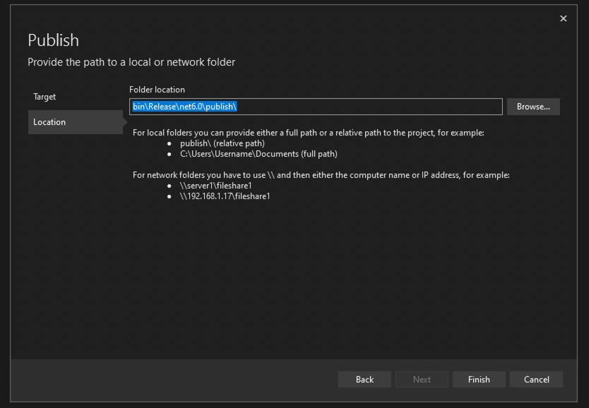
- Click **Publish**
  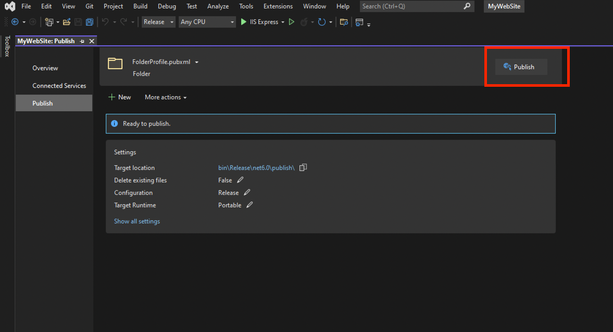
  
- Copy the fils of Folder *bin\Release\net6.0\publish\ (or your path)* to the server. Do not forget to copy your **database** folder to publish.
  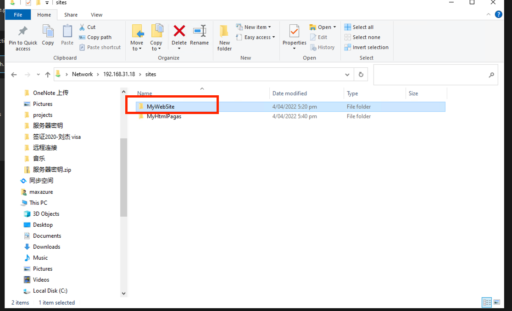
- open remote desktop to connect to the server
- Install [Microsoft .NET 6.0.3 Windows server Hosting](https://dotnet.microsoft.com/en-us/download/dotnet/6.0)
- 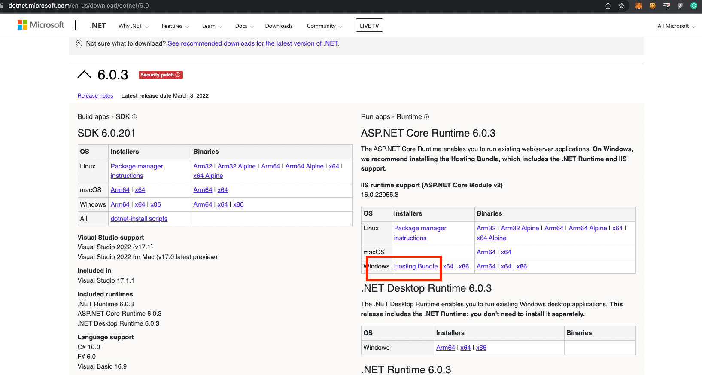
- open IIS management to **add** a new website
- Configure the website
  
- See the result.(configure your firewall if you can not access 8080 port)
  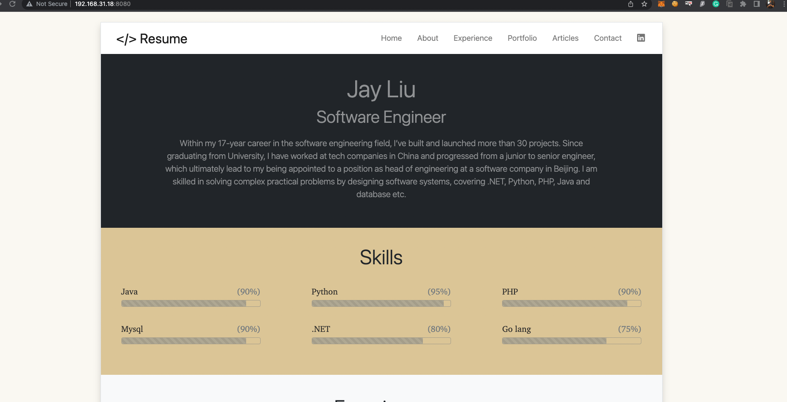
  
## 3. Deploy a dynamic web application with Nginx in Linux(Ubuntu 20.04)

- install dotnet 6 sdk on ubuntu
  https://docs.microsoft.com/en-us/dotnet/core/install/linux-ubuntu#2004-
- copy the file to server(by using FTP tools) 

- Run the command

```bash
dotnet mywebsite.dll
``` 

## 4. Build a web application with Docker Desktop on Windows

### There are two ways to generate docker files

1. Using VS2022 to build a docker image
2. Using the command line

### 4.1. Using VS2022 to depoly a docker image to Docker desktop

- Open VS2022, configure the project with following setup
  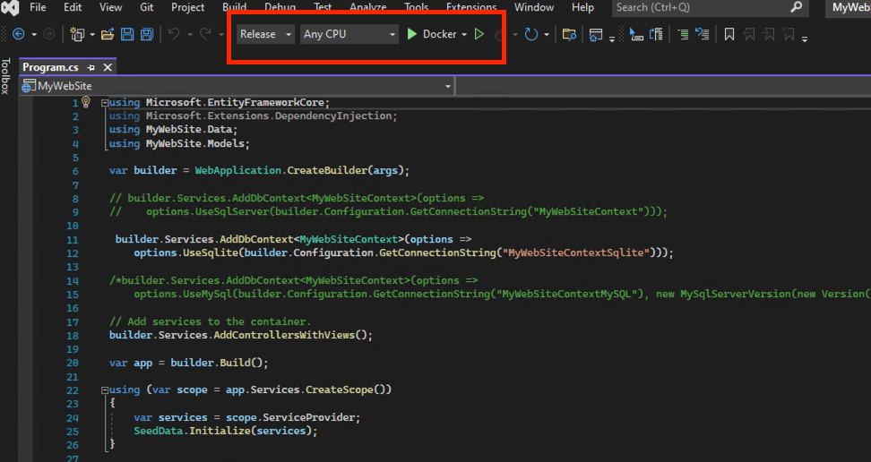
- Press F5 to start debugging
  
  you will get a docker image and automatically install to your docker desktop.
  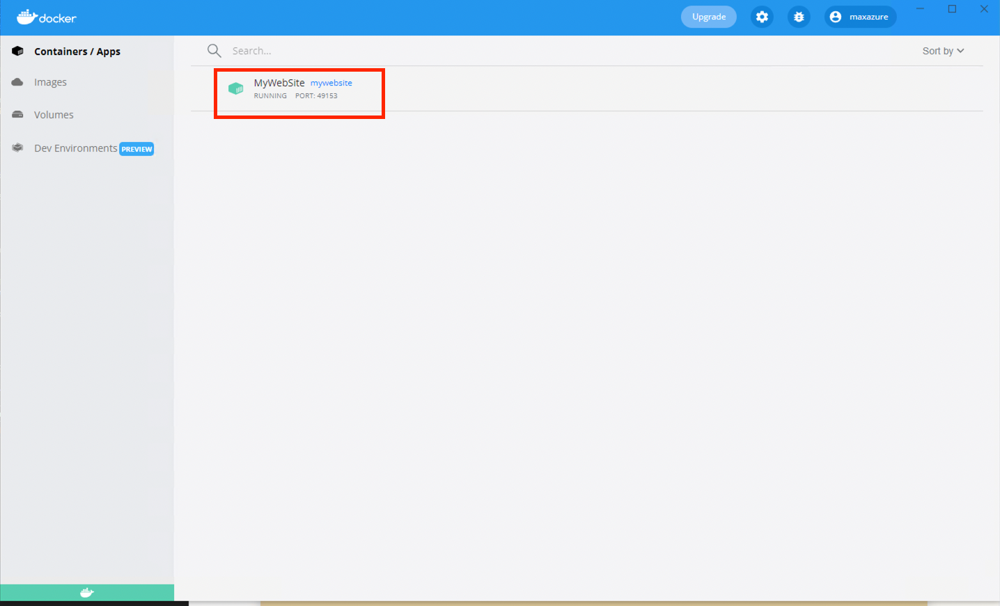

### 4.2. Using the command line to build a docker image

Dockerfile for the project

```dockerfile
FROM mcr.microsoft.com/dotnet/aspnet:6.0 AS base
WORKDIR /app
EXPOSE 80
EXPOSE 443

FROM mcr.microsoft.com/dotnet/sdk:6.0 AS build
WORKDIR /src
COPY . .
WORKDIR "/src/MyWebSite"
RUN ls
RUN dotnet build "MyWebSite.csproj" -c Release -o /app/build

FROM build AS publish
RUN dotnet publish "MyWebSite.csproj" -c Release -o /app/publish
# copy database to the image
COPY "/MyWebSite/db" "/app/publish/db"

FROM base AS final
WORKDIR /app
COPY --from=publish /app/publish .
ENTRYPOINT ["dotnet", "MyWebSite.dll"]
```

Run following cmd in Terminal

```powershell
cd [your project dockerfile path]
docker build -t mywebsiteimg ..
docker run -d --name mywebsiteimg -p 9000:80 mywebsiteimg
```

## 5. Publish  a Docker image to Docker Hub

- register a account on hub.docker.com
- open VS2022 and Click **Build** > **publish** [Project Name]
- select **Docker Container Registry** and Next
- select **Docker Hub** and Next
- Input username and pwd for logining Docker Hub
- click **Publish**

## 6. Deploy .Net 6 application  to a private linux server with Docker

- Install docker on the server
- pull docker image from Docker Hub

```bash
docker pull maxazure/mywebsite:latest
docker run -d --name mywebsite -p 9000:80 mywebsite
```

- configure a reverse proxy in Nginx
  
  <https://docs.microsoft.com/en-us/aspnet/core/host-and-deploy/linux-nginx?view=aspnetcore-6.0>

/etc/nginx/sites-enabled/mywebsite.709.co.nz

```nginx
server {
        server_name mywebsite.709.co.nz;
        index index.html index.htm;

        location / {
        include proxy_params;
        proxy_pass http://127.0.0.1:8190;
        add_header Access-Control-Allow-Origin *;
        add_header Access-Control-Allow-Methods 'GET, POST, OPTIONS, PUT, DELETE';
        }
}
```

- config HTTPS by using Certbot

## 7. Deploy .Net 6 application to Azure Cloud with Docker

- Go to https://portal.azure.com/#home to register an account
- find and read the docs of App service

### Deploy a docker image with App service on Azure Cloud

- Select **App Services**
  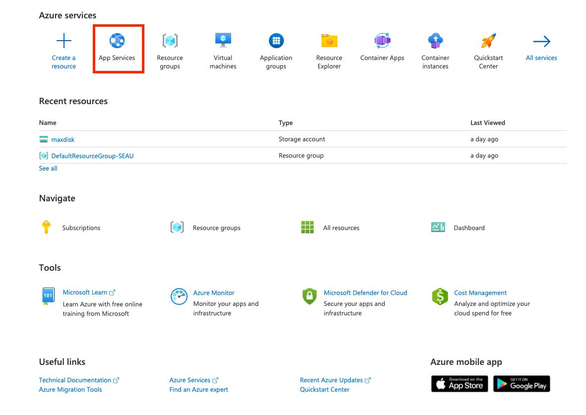
- click **Create**
  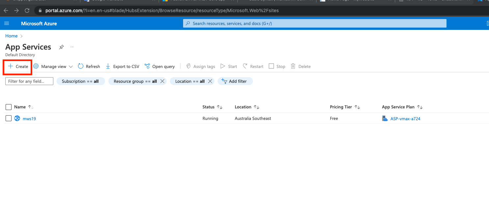
- Fill the form of **Create Web App**
  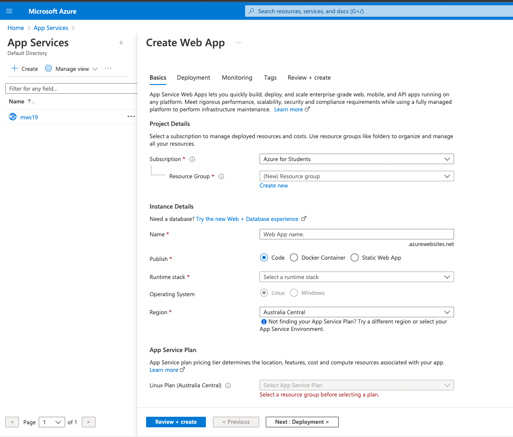
