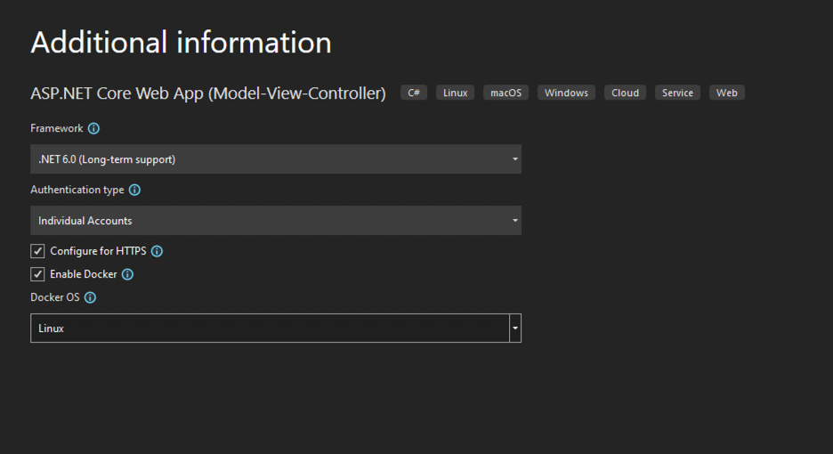
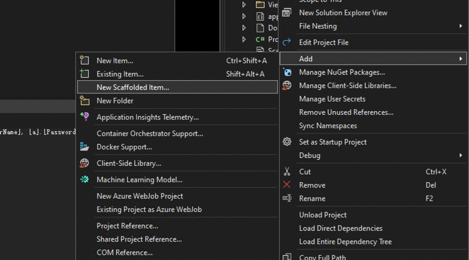
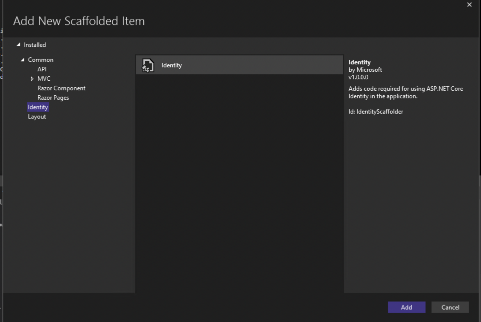
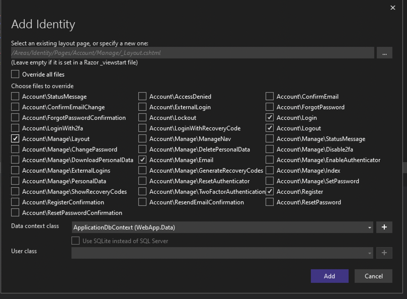
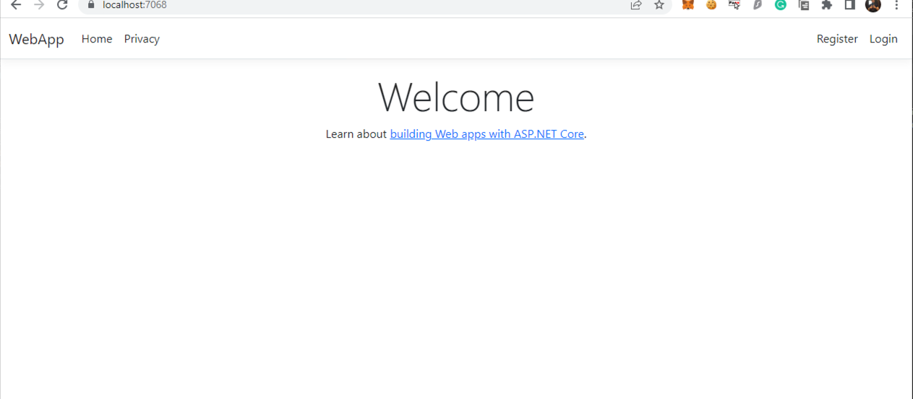
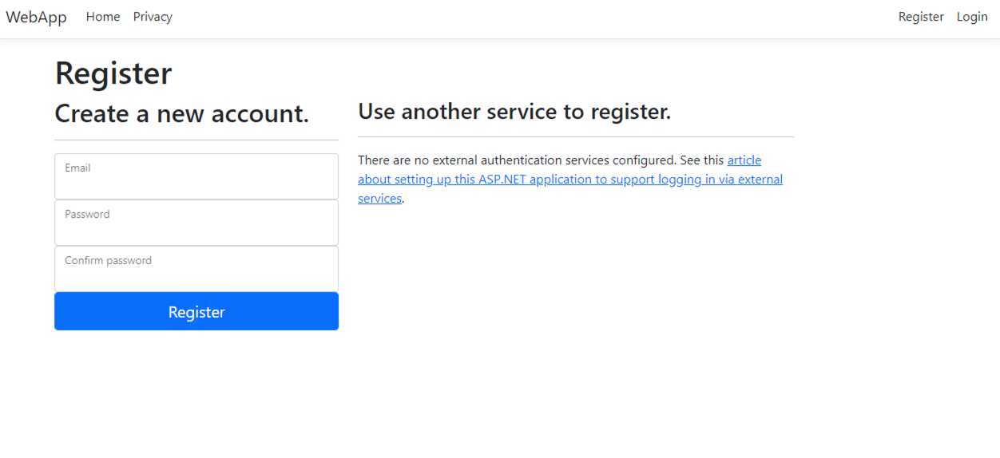
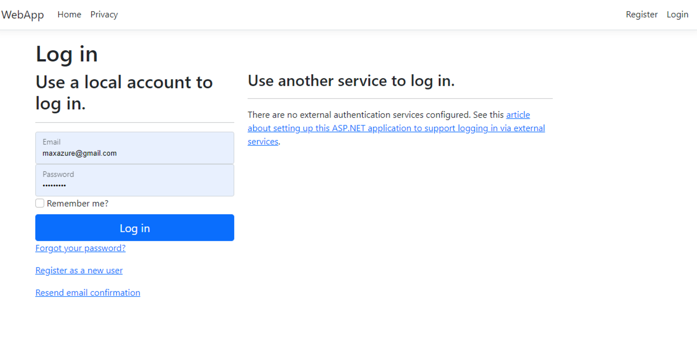
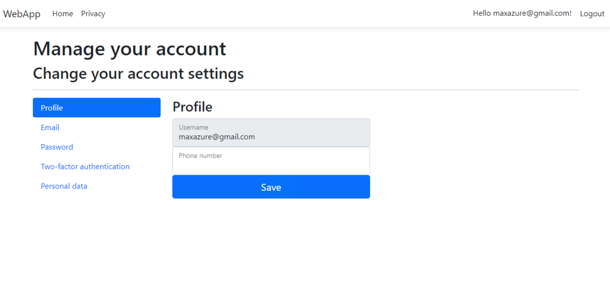
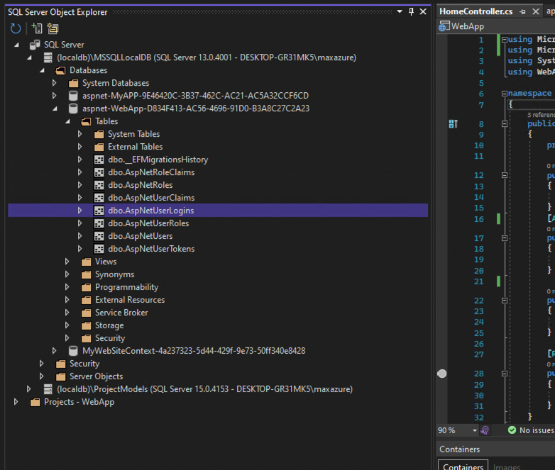

# .NET 6.0 MVC architecture authentication and authorization with Identity

## 1.0 Introduction .NET 6.0 MVC architecture

ASP.NET Core Identity is an API that supports user interface (UI) login functionality, it can manages users, passwords, profile data, roles, claims, tokens, email confirmation, and more.

Users can create an account with the login information stored in Identity or they can use an external login provider. Supported external login providers include Facebook, Google, Microsoft Account, and Twitter.

## 2.0 Objectives

- Learn how to use Identity to register, log in, and log out a user
- Learn how to use Identity to apply authentication to a page

## 3.0 Create a new MVC application with Identity

- Open VS 2022
- Select the ASP.NET Core Web App template. Name the project WebApp1 to have the same namespace as the project download. Click OK.
- In the Authentication type input, select Individual User Accounts.



- Add scaffold with Identity




- Run the following command in the Package Manager Console (PMC)

```powershell
Update-Database
```

### Test Register and Login

Run the app and register a user. Depending on your screen size, you might need to select the navigation toggle button to see the Register and Login links.







### View the Identity database

- From the View menu, select SQL Server Object Explorer (SSOX).
- Navigate to (localdb)MSSQLLocalDB(SQL Server 13). Right-click on dbo.AspNetUsers > View Data:


## Configure Identity service
Services are added in Program.cs. The typical pattern is to call methods in the following order:

1. Add{Service}
2. builder.Services.Configure{Service}

```cs
using Microsoft.AspNetCore.Identity;
using Microsoft.EntityFrameworkCore;
using WebApp.Data;

var builder = WebApplication.CreateBuilder(args);

// Add services to the container.
var connectionString = builder.Configuration.GetConnectionString("DefaultConnection");
builder.Services.AddDbContext<ApplicationDbContext>(options =>
    options.UseSqlServer(connectionString));
builder.Services.AddDatabaseDeveloperPageExceptionFilter();

builder.Services.AddDefaultIdentity<IdentityUser>(options => options.SignIn.RequireConfirmedAccount = true)
    .AddEntityFrameworkStores<ApplicationDbContext>();
builder.Services.AddControllersWithViews();

builder.Services.Configure<IdentityOptions>(options =>
{
    // Password settings.
    options.Password.RequireDigit = true;
    options.Password.RequireLowercase = true;
    options.Password.RequireNonAlphanumeric = true;
    options.Password.RequireUppercase = true;
    options.Password.RequiredLength = 6;
    options.Password.RequiredUniqueChars = 1;

    // Lockout settings.
    options.Lockout.DefaultLockoutTimeSpan = TimeSpan.FromMinutes(5);
    options.Lockout.MaxFailedAccessAttempts = 5;
    options.Lockout.AllowedForNewUsers = true;

    // User settings.
    options.User.AllowedUserNameCharacters =
    "abcdefghijklmnopqrstuvwxyzABCDEFGHIJKLMNOPQRSTUVWXYZ0123456789-._@+";
    options.User.RequireUniqueEmail = false;
});

builder.Services.ConfigureApplicationCookie(options =>
{
    // Cookie settings
    options.Cookie.HttpOnly = true;
    options.ExpireTimeSpan = TimeSpan.FromMinutes(5);

    options.LoginPath = "/Identity/Account/Login";
    options.AccessDeniedPath = "/Identity/Account/AccessDenied";
    options.SlidingExpiration = true;
});

var app = builder.Build();

// Configure the HTTP request pipeline.
if (app.Environment.IsDevelopment())
{
    app.UseMigrationsEndPoint();
}
else
{
    app.UseExceptionHandler("/Home/Error");
    // The default HSTS value is 30 days. You may want to change this for production scenarios, see https://aka.ms/aspnetcore-hsts.
    app.UseHsts();
}

app.UseHttpsRedirection();
app.UseStaticFiles();

app.UseRouting();

app.UseAuthentication();
app.UseAuthorization();

app.MapControllerRoute(
    name: "default",
    pattern: "{controller=Home}/{action=Index}/{id?}");
app.MapRazorPages();

app.Run();

```

The preceding code configures Identity with default option values. Services are made available to the app through dependency injection.

Identity is enabled by calling UseAuthentication. UseAuthentication adds authentication middleware to the request pipeline.

The template-generated app doesn't use authorization. app.UseAuthorization is included to ensure it's added in the correct order should the app add authorization. UseRouting, UseAuthentication, and UseAuthorization must be called in the order shown in the preceding code.


### Test Identity

The default web project templates allow anonymous access to the home pages. To test Identity, add [Authorize]:

```cs
using Microsoft.AspNetCore.Authorization;
using Microsoft.AspNetCore.Mvc.RazorPages;
using Microsoft.Extensions.Logging;

namespace WebApp1.Pages
{
    // add following line to enable Authorization
    [Authorize]
    public class PrivacyModel : PageModel
    {
        private readonly ILogger<PrivacyModel> _logger;

        public PrivacyModel(ILogger<PrivacyModel> logger)
        {
            _logger = logger;
        }

        public void OnGet()
        {
        }
    }
}
```


## 4.0 Add identify to an existing MVC application

- From Solution Explorer, right-click on the project > Add > New Scaffolded Item.
- From the left pane of the Add New Scaffolded Item dialog, select Identity. Select Identity in the center pane. Select the Add button.
- In the Add Identity dialog, select the options you want.
  - Select your existing layout page so your layout file isn't overwritten with incorrect markup. When an existing _Layout.cshtml file is selected, it is not overwritten. For example:
    - ~/Pages/Shared/_Layout.cshtml for Razor Pages or Blazor Server projects with existing Razor Pages infrastructure.
    - ~/Views/Shared/_Layout.cshtml for MVC projects or Blazor Server projects with existing MVC infrastructure.
- To use your existing data context, select at least one file to override. You must select at least one file to add your data context.
  - Select your data context class.
  - Select Add.
- To create a new user context and possibly create a custom user class for Identity:
  - Select the + button to create a new Data context class. Accept the default value or specify a class (for example, MyApplication.Data.ApplicationDbContext).
  - Select Add.

## 5.0 references

More information: <https://docs.microsoft.com/en-us/aspnet/core/security/authentication/identity?view=aspnetcore-6.0&tabs=visual-studio>
