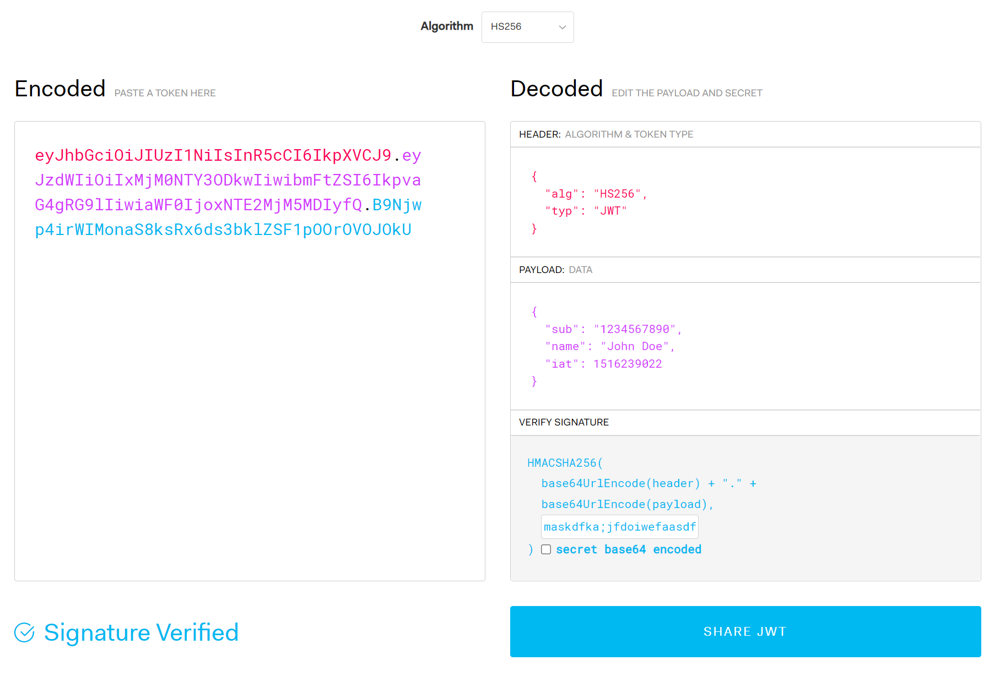

# Work on Server-side API with .Net 6 JWT

## Intro

In this lesson, we will start to have a deep understanding about Web API and NET core. First we will discuss about the method of formatting output Json to API. Then, we will learn JWT as the method of user authentication.

### What is JWT(JSON Web Tokens)?

JSON Web Token (JWT) is an open standard (RFC 7519) for securely transmitting information between parties as JSON object.

It is compact, readable and digitally signed using a private key/ or a public key pair by the Identity Provider(IdP). So the integrity and authenticity of the token can be verified by other parties involved.

The purpose of using JWT is not to hide data but to ensure the authenticity of the data. JWT is signed and encoded, not encrypted.

JWT is a token based stateless authentication mechanism. Since it is a client-side based stateless session, server doesn’t have to completely rely on a datastore(database) to save session information. 

Structure of JWT
A JSON Web Token consists of 3 parts separated by a period.

```
header.payload.signature
```


[Refer from Suresh Kumar](https://medium.com/@sureshdsk/how-json-web-token-jwt-authentication-works-585c4f076033)

[Learn about JWT](https://jwt.io/)




When the header or payload changes, signature has to calculated again. Only the Identity Provider(IdP) has the private key to calculate the signature which prevents the tampering of token.

```javascript
// signature algorithm
data = base64urlEncode( header ) + “.” + base64urlEncode( payload )

signature = HMAC-SHA256( data, secret_salt )
```

### Why we need JWT?

Let's think about Cookie(&session)


### How does JWT work?

1. The user/client app sends a sign-in request. In other words, here is where your username/password (or any other type of sign-in credentials you need to provide) will travel
2. Once verified, the API will create a JSON Web Token and sign it using a secret key
3. Then the API will return that token back to the client application
4. Finally, the client app will receive the token, verify it on its own side to make sure it’s authentic, and then proceed to use it on every subsequent request to authenticate the user without having to send their credentials anymore

## Implementing JWT Authentication in .NET Core
