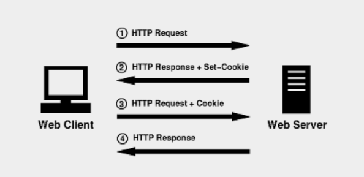

# Work on Server-side API with .Net 6 JWT

## Intro

In this lesson, we will start to have a deep understanding about Web API and NET core. First we will discuss about the method of formatting output Json to API. Then, we will learn JWT as the method of user authentication.

### What is JWT(JSON Web Tokens)?

JSON Web Token (JWT) is an open standard (RFC 7519) for securely transmitting information between parties as JSON object.

It is compact, readable and digitally signed using a private key/ or a public key pair by the Identity Provider(IdP). So the integrity and authenticity of the token can be verified by other parties involved.

The purpose of using JWT is not to hide data but to ensure the authenticity of the data. JWT is signed and encoded, not encrypted.

JWT is a token based stateless authentication mechanism. Since it is a client-side based stateless session, server doesn’t have to completely rely on a datastore(database) to save session information. 

Structure of JWT
A JSON Web Token consists of 3 parts separated by a period.

```
header.payload.signature
```


[Refer from Suresh Kumar](https://medium.com/@sureshdsk/how-json-web-token-jwt-authentication-works-585c4f076033)

[Learn about JWT](https://jwt.io/)


When the header or payload changes, signature has to calculated again. Only the Identity Provider(IdP) has the private key to calculate the signature which prevents the tampering of token.

```javascript
// signature algorithm
data = base64urlEncode( header ) + “.” + base64urlEncode( payload )

signature = HMAC-SHA256( data, secret_salt )
```

### Why we need JWT?

Let's think about Cookie(&session)




### How does JWT work?

1. The user/client app sends a sign-in request. In other words, here is where your username/password (or any other type of sign-in credentials you need to provide) will travel
2. Once verified, the API will create a JSON Web Token and sign it using a secret key
3. Then the API will return that token back to the client application
4. Finally, the client app will receive the token, verify it on its own side to make sure it’s authentic, and then proceed to use it on every subsequent request to authenticate the user without having to send their credentials anymore

## Implementing JWT Authentication in .NET Core

The first step is to install the necessary NuGet Package(s).

To install the required packages into your project, execute the following commands at the NuGet Package Manager Console.

```bash
dotnet add package Microsoft.AspNetCore.Authentication
dotnet add package Microsoft.AspNetCore.Authentication.JwtBearer
```

## Creating a new project

In this section, we will create a new project to implement JWT, it will need a controller AuthenticateController to authenticate and the Home controller will contain some demo methods to demonstrate authentication.

We will ignore the project creation step and start directly with creating Models and configuring Program.cs.

## Creating the Model classes

In order to format our API Json output, we need to create a Model class, call it WebApiResult.cs which is located at \Models\ViewModels\UI\WebApiResult.cs

<https://github.com/jayinvers/MyOnlineBookShop/blob/master/MyOnlineShop/Models/ViewModels/UI/WebApiResult.cs>

```cs
namespace MyOnlineShop.Models.ViewModels.UI
{
    public class WebApiResult
    {
        public int Status { get; set; } = 200;
        public object? Data { get; set; }
        public string Message { get; set; } = "Success";

        public WebApiResult()
        {
        }
        public WebApiResult(object data)
        {
            Data = data;
        }

    }
}

```

(Demo on WebApiResult in class)

This is a sample file, if you need to use a mature React Admin panel template, it often has its own API interface standard. And WebApiResult shows you how to customize your API to suit different clients.

### Creating  Model Classes for Login and register

<https://github.com/jayinvers/MyOnlineBookShop/tree/master/MyOnlineShop/Models/ViewModels>

```cs
using System.ComponentModel.DataAnnotations;
namespace MyOnlineShop.Models.ViewModels
{
    public class Login
    {
        [Required(ErrorMessage = "User Name is required")]
        public string? Username { get; set; }

        [Required(ErrorMessage = "Password is required")]
        public string? Password { get; set; }
    }
}
```

```cs
using System.ComponentModel.DataAnnotations;

namespace MyOnlineShop.Models.ViewModels
{
    public class Register
    {
        [Required(ErrorMessage = "User Name is required")]
        public string? Username { get; set; }

        [EmailAddress]
        [Required(ErrorMessage = "Email is required")]
        public string? Email { get; set; }

        [Required(ErrorMessage = "Password is required")]
        public string? Password { get; set; }
    }
}

```

Unlike the Entity Models we created in the past, these files do not have corresponding database tables. They are created to standardize the JSON data submitted.

And in Models folder, we are also creating a Model for Roles

<https://github.com/jayinvers/MyOnlineBookShop/blob/master/MyOnlineShop/Models/UserRoles.cs>

```cs
namespace MyOnlineShop.Models
{
    public static class UserRoles
    {
        public const string Admin = "Admin";
        public const string User = "User";
    }
}
```

Finally, we need to add a DbContext class as the database connection configuration. We've covered it in previous tutorials and won't repeat it here.

Here is the complete DataContext.cs as follows

<https://github.com/jayinvers/MyOnlineBookShop/blob/master/MyOnlineShop/Data/DataContext.cs>

## Configuring JWT options in Program.cs

First of all, we have to add a service for Identity and set a DefaultTokenProviders

```cs
builder.Services.AddIdentity<IdentityUser, IdentityRole>()
                .AddEntityFrameworkStores<DataContext>()
                .AddDefaultTokenProviders();
```

Then, set up a rules for passwords

```cs
builder.Services.Configure<IdentityOptions>(options =>
{
    // Default Password settings.
    options.Password.RequireDigit = false;
    options.Password.RequireLowercase = false;
    options.Password.RequireNonAlphanumeric = false;
    options.Password.RequireUppercase = false;
    options.Password.RequiredLength = 6;
    options.Password.RequiredUniqueChars = 0;
});
```

Next, add Authentication and Configure JwtBearer

```cs
// Add Authentication
builder.Services.AddAuthentication(options =>
{
    options.DefaultAuthenticateScheme = JwtBearerDefaults.AuthenticationScheme;
    options.DefaultChallengeScheme = JwtBearerDefaults.AuthenticationScheme;
    options.DefaultScheme = JwtBearerDefaults.AuthenticationScheme;
})
.AddJwtBearer(options => // Add Jwt Bearer
{
    options.SaveToken = true;
    options.RequireHttpsMetadata = false;
    options.TokenValidationParameters = new TokenValidationParameters()
    {
        ValidateIssuer = true,
        ValidateAudience = true,
        ValidAudience = builder.Configuration["JWT:ValidAudience"],
        ValidIssuer = builder.Configuration["JWT:ValidIssuer"],
        IssuerSigningKey = new SymmetricSecurityKey(Encoding.UTF8.GetBytes(builder.Configuration["JWT:Secret"]))
    };
});
```

Add authentication and authorization middleware.

```cs
app.UseAuthentication();
app.UseAuthorization();
```

The complete code is as follows Url

<https://github.com/jayinvers/MyOnlineBookShop/blob/master/MyOnlineShop/Program.cs>


## Implementing login and registration

Next, we add a controller to the controllers folder, named AuthenticateController.cs

And we are going to add Login API.

Before we do this, we have to add three Objects for access Users data

```cs
        private readonly UserManager<IdentityUser> _userManager;
        private readonly RoleManager<IdentityRole> _roleManager;
        private readonly IConfiguration _configuration;

        public AuthenticateController(
                UserManager<IdentityUser> userManager,
                RoleManager<IdentityRole> roleManager,
                IConfiguration configuration
            )
                {
                    _userManager = userManager;
                    _roleManager = roleManager;
                    _configuration = configuration;
                }
```

In order to calculate the value of the Token, we need the following function:

```cs
private JwtSecurityToken GetToken(List<Claim> authClaims)
        {
            var authSigningKey = new SymmetricSecurityKey(Encoding.UTF8.GetBytes(_configuration["JWT:Secret"]));

            var token = new JwtSecurityToken(
                issuer: _configuration["JWT:ValidIssuer"],
                audience: _configuration["JWT:ValidAudience"],
                expires: DateTime.Now.AddHours(3),
                claims: authClaims,
                signingCredentials: new SigningCredentials(authSigningKey, SecurityAlgorithms.HmacSha256)
                );

            return token;
        }
```

Now start creating our Login

```cs
 [HttpPost]
        [Route("login")]
        public async Task<WebApiResult> Login([FromBody] Login model)
        {
            var user = await _userManager.FindByNameAsync(model.Username);
            if (user != null && await _userManager.CheckPasswordAsync(user, model.Password))
            {
                var userRoles = await _userManager.GetRolesAsync(user);
                var authClaims = new List<Claim>
                {
                    new Claim(ClaimTypes.Name, user.UserName),
                    new Claim(JwtRegisteredClaimNames.Jti, Guid.NewGuid().ToString()),
                };

                foreach (var userRole in userRoles)
                {
                    authClaims.Add(new Claim(ClaimTypes.Role, userRole));
                }

                var token = GetToken(authClaims);

                return new WebApiResult(new
                {
                    token = new JwtSecurityTokenHandler().WriteToken(token),
                    expiration = token.ValidTo
                });
            }
            return new WebApiResult { Status = 301, Message = "Unauthorized" };
  
        }
```

and register

```cs
        [HttpPost]
        [Route("register")]
        public async Task<WebApiResult> Register([FromBody] Register model)
        {
            var userExists = await _userManager.FindByNameAsync(model.Username);
            if (userExists != null)
                return new WebApiResult { Status = 500, Message = "User already exists!" };

            IdentityUser user = new()
            {
                Email = model.Email,
                SecurityStamp = Guid.NewGuid().ToString(),
                UserName = model.Username
            };
            var result = await _userManager.CreateAsync(user, model.Password);
            if (!result.Succeeded)
                return new WebApiResult { Status = 500, Message = "User creation failed! Please check user details and try again." };

            return new WebApiResult { Status = 200, Message = "User created successfully!" };
        }
```

The complete AuthenticationController.cs is below

<https://github.com/jayinvers/MyOnlineBookShop/blob/master/MyOnlineShop/Controllers/AuthenticateController.cs>


## How to apply authorization in a controller

Next we need to create a Homecontroller to test our authorization by using keyword **[Authorize]** or **[Authorize(Roles = UserRoles.Admin)]**

```cs
        [Authorize]
        [Route("index")]
        [HttpGet]
        public WebApiResult Get()
        {
            BookDTO book = new BookDTO() { Title = "My 1st Book", Picture = "/pic/1.png" };
            BookDTO book1 = new BookDTO() { Title = "My 2nd Book", Picture = "/pic/2.png" };

            WebApiResult result = new WebApiResult(new List<BookDTO>() { book, book1 });
            return result;
        }
```

<https://github.com/jayinvers/MyOnlineBookShop/blob/master/MyOnlineShop/Controllers/HomeController.cs>
