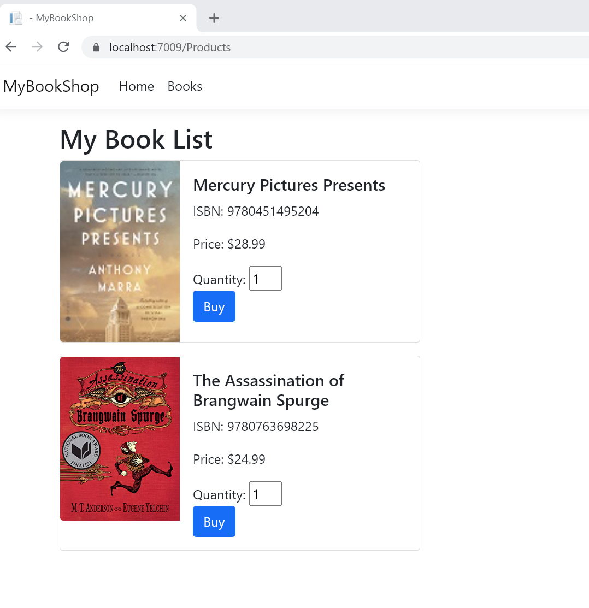
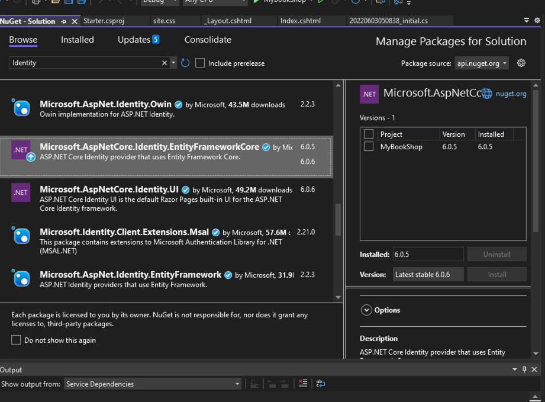

# Dive into Identity - User Reg & Login with mutiple Roles

Today, let's take a deeper look at Microsoft identity. This is a great opportunity to learn about the features we can achieve with the help of Microsoft Identity.
We will implement user authorization related functions through an example of an online bookstore. This tutorial will show how to use **roles** to separate admin users from consumer users.

## Objectives

- Learn how to create your own login, logout and register functions without an identity template
- Learn how to use UserManager, and RoleManager to create users or roles.
- Learn how to create an order with a user ID.

## Lab Task

- Create a registration page on your own by following this tutorial.
- Implement the buy action.

## Project Source Code

https://github.com/jayinvers/MyBookShop

An example of online book store based on asp.net 6.

This source code has only a list of books that you can download as a starting point for our Lab.




## TODO

- Add a login page.
- Display UserName on the topmenu of page(_Layout)
- Specify the login jump path according to the user's role. (Example: Admin goes to /admin, and Consumer goes to /)
- Implement the buy book action with UserId.

## Step 1. Clone the base project code local

```bash
git clone https://github.com/jayinvers/MyBookShop.git
cd MybookShop
```

Open the project file **MyBookShop.sln**

## Step 2. Install Identity in PMC

### Add Identity packages to your app

In Solution Explorer, right-click your project and select Manage NuGet Packages. Search for and install the Microsoft.AspNet.Identity.EntityFramework package.



Note that this package will install the dependency packages: EntityFramework and Microsoft ASP.NET Identity Core.

## Step 3. Configure Indetity in **Program.cs**

Add Usings in the top of Program.cs

```cs
using Microsoft.AspNetCore.Identity;
```

### 1. Add config code for Indentity services

```cs
builder.Services.AddIdentity<User, IdentityRole>(options => options.SignIn.RequireConfirmedAccount = false)
    .AddRoles<IdentityRole>()
    .AddEntityFrameworkStores<DataContext>();
```

This configuration is different from the past. We set up a new Identity Service with **AddIdentity()**. And use **AddRoles()** in order to support roles (user groups).


### 2. Configure IdentityOptions for password rules.

```cs
builder.Services.Configure<IdentityOptions>(options =>
{
    // Default Password settings.
    options.Password.RequireDigit = false;
    options.Password.RequireLowercase = false;
    options.Password.RequireNonAlphanumeric = false;
    options.Password.RequireUppercase = false;
    options.Password.RequiredLength = 6;
    options.Password.RequiredUniqueChars = 0;
});
```

### 3. Configure the path when you get login failed or AccessDenied

```cs
builder.Services.ConfigureApplicationCookie(options =>
{
    options.Cookie.Name = "MyBookShop";
    options.AccessDeniedPath = "/AccessDenied";
    options.LoginPath = "/login";
});
```

### 4. Add  app.UseAuthentication(); after app.UseAuthorization();

```cs
app.UseAuthentication();

app.UseAuthentication();
```

## Step 4. Add **AuthController.cs** to Controllers folder

AuthController.cs

```cs
using Microsoft.AspNetCore.Mvc;
using Microsoft.AspNetCore.Identity;
using Microsoft.EntityFrameworkCore;
using MyBookShop.Models.Entities;
using Microsoft.AspNetCore.Authorization;
using System.ComponentModel.DataAnnotations;
using MyBookShop.Models.ViewModels;

namespace MyBookshop.Controllers
{
    public class AuthController : Controller
    {

        private readonly UserManager<User> _userManager;
        private readonly SignInManager<User> _signInManager;
        private readonly RoleManager<IdentityRole> _roleManager;

        public AuthController(UserManager<User> userManager, RoleManager<IdentityRole> roleManager, SignInManager<User> signInManager)
        {
            _userManager = userManager;
            _roleManager = roleManager;
            _signInManager = signInManager;
        }

        public IActionResult Index()
        {
            return View();
        }

        [AllowAnonymous]
        [Route("/login")]
        public async Task<IActionResult> Login()
        {
            LoginViewModel input = new LoginViewModel();
            return View(input);
        }

        [HttpPost("/login")]
        [AllowAnonymous]
        public async Task<IActionResult> Login([Bind("Username,Password,RememberMe")] LoginViewModel input, string returnUrl = null)
        {
            returnUrl ??= Url.Content("~/admin");

            
            if (ModelState.IsValid)
            {
                var result = await _signInManager.PasswordSignInAsync(input.Username, input.Password, input.RememberMe, lockoutOnFailure: false);
                if (result.Succeeded)
                {


                    var user = await _userManager.FindByNameAsync(input.Username);

                    var roles = await GetUserRoles(user);
                       

                    if (!roles.Contains("Administrator"))
                    {
                        return LocalRedirect("/");
                    }
                    else
                    {
                        return LocalRedirect(returnUrl);
                    }
                   
                }
                else
                {
                    ModelState.AddModelError(string.Empty, "Invalid login attempt.");
                    return View(input);
                }
            }

            return View(input);
        }
// Add a Action in Controller for Log Out.
        [AllowAnonymous]
        [Route("/logout")]
        public async Task<IActionResult> Logout(string returnUrl = null)
        {
            await _signInManager.SignOutAsync();

            if (returnUrl != null)
            {
                return LocalRedirect(returnUrl);
            }
            else
            {
                return LocalRedirect("/Admin");
            }
        }
        private  Task<User> GetCurrentUserAsync()
        {
            return _userManager.GetUserAsync(HttpContext.User);
        }

        private async Task<List<string>> GetUserRoles(User user)
        {
            return new List<string>(await _userManager.GetRolesAsync(user));
        }
    }
}

```
### Add a ViewModel for login form.
also we neet create a new model for login 

LoginViewModel.cs

```cs
using System.ComponentModel.DataAnnotations;

namespace MyBookShop.Models.ViewModels
{
    public class LoginViewModel
    {
            [Required]
            public string Username { get; set; }

            [Required]
            [DataType(DataType.Password)]
            public string Password { get; set; }
            [Display(Name = "Remember me?")]
            public bool RememberMe { get; set; }
    }
}
```


## Step 5. Implementing Login.cshtml

Create a new folder **Auth** under Views

```html
@model MyBookShop.Models.ViewModels.LoginViewModel;
@{
    ViewData["Title"] = "Log in";
    Layout = null;
}
<!DOCTYPE html>
<html lang="en">

<head>
    <meta charset="utf-8" />
    <meta name="viewport" content="width=device-width, initial-scale=1.0" />
    <title>Admin Panel</title>
    <link rel="stylesheet" href="~/lib/bootstrap/dist/css/bootstrap.min.css" />
    <link rel="stylesheet" href="~/css/site.css" asp-append-version="true" />
    <link rel="stylesheet" href="~/MyWebSite.styles.css" asp-append-version="true" />
    <link rel="stylesheet" href="https://cdn.jsdelivr.net/npm/bootstrap-icons@1.8.1/font/bootstrap-icons.css">
    <style>
        html,
        body {
            height: 100%;
        }

        body {
            display: flex;
            align-items: center;
            padding-top: 40px;
            padding-bottom: 40px;
            background-color: #f5f5f5;
        }

        .form-signin {
            width: 100%;
            max-width: 330px;
            padding: 15px;
            margin: auto;
        }

            .form-signin .checkbox {
                font-weight: 400;
            }

            .form-signin .form-floating:focus-within {
                z-index: 2;
            }

            .form-signin input[type="email"] {
                margin-bottom: -1px;
                border-bottom-right-radius: 0;
                border-bottom-left-radius: 0;
            }

            .form-signin input[type="password"] {
                margin-bottom: 10px;
                border-top-left-radius: 0;
                border-top-right-radius: 0;
            }
    </style>
</head>

<body class="text-center">
    <main class="form-signin">

        <section>
            <form id="account" method="post">
                <h1 class="h3 mb-3 fw-normal">Admin Panel</h1>

                <hr />
                <div asp-validation-summary="ModelOnly" class="text-danger"></div>
                <div class="form-floating">
                    <input asp-for="@Model.Username" class="form-control" autocomplete="username" aria-required="true" />
                    <label asp-for="@Model.Username" class="form-label"></label>
                    <span asp-validation-for="@Model.Username" class="text-danger"></span>
                </div>
                <div class="form-floating">
                    <input asp-for="@Model.Password" class="form-control" autocomplete="current-password" aria-required="true" />
                    <label asp-for="@Model.Password" class="form-label"></label>
                    <span asp-validation-for="@Model.Password" class="text-danger"></span>
                </div>
                <div>
                    <div class="checkbox">
                        <label asp-for="@Model.RememberMe" class="form-label">
                            <input class="form-check-input" asp-for="@Model.RememberMe" />
                            Remember Me
                        </label>
                    </div>
                </div>
                <div>
                    <button id="login-submit" type="submit" class="w-100 btn btn-lg btn-primary">Sign In</button>
                </div>

            </form>
        </section>

    </main>
    <script src="~/lib/jquery/dist/jquery.min.js"></script>

    <script src="~/lib/bootstrap/dist/js/bootstrap.bundle.min.js"></script>
    <script src="~/js/site.js" asp-append-version="true"></script>
    <partial name="_ValidationScriptsPartial" />

</body>
</html>
```

## Step 5. Adding User Data by using SeedData.cs

```cs
using Microsoft.EntityFrameworkCore;
using Microsoft.Extensions.DependencyInjection;
using Microsoft.AspNetCore.Identity;
using MyBookShop.Data;
using MyBookShop.Models.Entities;

namespace MyBookShop
{
    public static class SeedData
    {
        public const string AdministratorRole = "Administrator";
        public const string CustomerRole = "Customer";

        public static async Task Initialize(IServiceProvider serviceProvider)
        {
            //            using (var context = new DatabaseContext(serviceProvider.GetRequiredService<DbContextOptions<DatabaseContext>>()))
            //           {
            //                if (!context.Categories.Any())
            //                    context.Categories.Add(new Category { Name="Category Abc"});
            //                    context.SaveChanges();
            //            }

            var roleManager = serviceProvider.GetRequiredService<RoleManager<IdentityRole>>();
            var userManager = serviceProvider.GetRequiredService<UserManager<User>>();

            await EnsureRolesAsync(roleManager, AdministratorRole);
            await EnsureRolesAsync(roleManager, CustomerRole);
            await EnsureTestAdminAsync(userManager, "admin", "admin@admin.com", "11111111", AdministratorRole);
            await EnsureTestAdminAsync(userManager, "user", "user@shop.com", "11111111", CustomerRole);

        }

        private static async Task EnsureRolesAsync(RoleManager<IdentityRole> roleManager, string roleName)
        {
            var alreadyExists = await roleManager.RoleExistsAsync(roleName);

            if (alreadyExists) return;

            await roleManager.CreateAsync(new IdentityRole(roleName));
        }

        private static async Task EnsureTestAdminAsync(UserManager<User> userManager, string username, string email,string pwd, string roleName)
        {
            var testUser = await userManager.Users
                .Where(x => x.UserName == username)
                .SingleOrDefaultAsync();

            if (testUser != null) return;

            testUser = new User
            {
                UserName = username,
                Email = email
            };
            await userManager.CreateAsync(testUser, pwd);
            await userManager.AddToRoleAsync(testUser, roleName);
        }
    }
}
```

### Add add Code to program to call the file SeedData.cs

Under the sentent "var app = builder.Build();"

```cs
if (app.Environment.IsDevelopment())
{
    using (var scope = app.Services.CreateScope())
    {
        var services = scope.ServiceProvider;
        MyBookShop.SeedData.Initialize(services).Wait();
    }
}
```

## Step 6. Using _LoginPartial in your _Layout.cshtml file

_LoginPartial.cshtml

```html
@using Microsoft.AspNetCore.Identity
@using MyBookShop.Models.Entities
@inject SignInManager<User> SignInManager
@inject UserManager<User> UserManager

<ul class="navbar-nav login">
@if (SignInManager.IsSignedIn(User))
{
    <li class="nav-item pe-3">
        <a class="nav-link" href="/myprofile" >Hi @User.Identity?.Name</a>
    </li>
    <li class="nav-item pe-3">
        <form  class="form-inline" action="/logout">
            <button  type="submit" class="nav-link btn btn-link">Sign Out</button>
        </form>
    </li>
}
else
{
    <li class="nav-item pe-3">
        <a class="nav-link"  asp-route="/Register">Register</a>
    </li>
    <li class="nav-item pe-3">
        <a class="nav-link" asp-route="/login">Sign In</a>
    </li>
}
</ul>

```

Or you can use the code below to make login button on the top of menu.

```html
                    @if (SignInManager.IsSignedIn(User))
                    {
                        <a class="my-2 my-sm-0 text-light me-4" href="/myprofile" >Hi @User.Identity?.Name</a>
                        if(User.IsInRole("Administrator")){
                            <a class="my-2 my-sm-0 text-light me-4" href="/Admin" >Admin Panel</a>
                        }
                        else{
                            <a class="my-2 my-sm-0 text-light me-4" href="/logout" >Log out</a>
                        }
                    }
                    else
                    {
                         <a class="my-2 my-sm-0 text-light me-4" href="/login">Sign in</a>
                    }

```

and add following code in the begining of _Layout.cshtml

```html
@using Microsoft.AspNetCore.Identity
@using MyBookShop.Models.Entities
@inject SignInManager<User> SignInManager
```


## Add-migration and update-database
